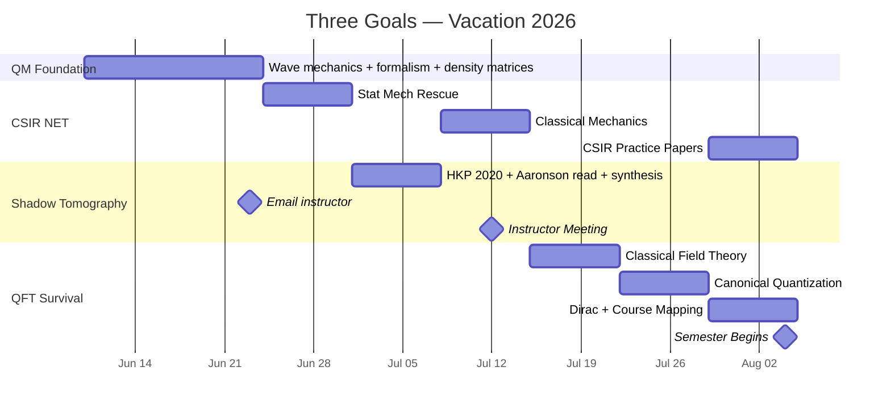

# 🔬 Three Goals. One Vacation. One Plan.
**IISER Kolkata · BS-MS Year 4 Prep · June 10 – August 4, 2026**

---

> [!abstract]+ The Three Goals
> | Priority | Goal | Why It Matters | Deadline |
> |---|---|---|---|
> | 🥇 | **CSIR NET** Physical Sciences | Only reliable path to funded PhD with a low CGPA | Dec 2026 |
> | 🥈 | **Shadow Tomography** | Instructor mentorship → recommendation letter | Mid-July meeting |
> | 🥉 | **QFT Survival** (PH4106) | Don't fail another core course | Aug 2026 |

---

> [!success]+ Why This Is Less Overwhelming Than It Looks
> These are **not three separate mountains**. They share the same foundation.
>
> | What You Study | CSIR NET | Shadow Tomo | QFT (PH4106) |
> |---|---|---|---|
> | QM formalism (bra-ket, operators) | ✅ QM section | ✅ Core language | ✅ Language of QFT |
> | Density matrices + measurements | ✅ QM section | ✅ Direct prerequisite | ✅ Quantum states |
> | Statistical Mechanics | ✅ Stat Mech section | — | ✅ QFT applications |
> | Classical Mechanics (Lagrangian) | ✅ CM section | — | ✅ Foundation of QFT |
> | Math Methods (linear algebra, Fourier) | ✅ Section I | ✅ Paper math | ✅ Mode expansions |
>
> You are building **one foundation** that feeds all three. The overlap is the plan.

---

## 🗓️ Master Timeline



---

## 📧 The Instructor Email — Solved

> [!danger]+ Do NOT Email the Instructor Right Now
> You have nothing studied. Sending an email today with nothing to show creates more anxiety, not less. The plan has a specific send date: **June 23**. By that day, you will have genuinely studied density matrices, measurements, and opened the paper. The email below will be completely honest on June 23.

**Send on: June 23 (end of Week 2)**

```
Subject: Shadow Tomography — Reading Progress and Meeting Request

Dear Prof. [Name],

I hope you are well. I wanted to update you on the topic of
Shadow Tomography that you suggested. I have been going through
the foundational quantum information formalism — density matrices
and measurement theory — and have started reading the relevant
papers. I would like to schedule a meeting in mid-July to discuss
what I have understood and get your guidance on next steps.

I am on campus from June 9. Please let me know a time convenient
for you.

With regards,
[Your name]
```

> [!tip]+ Why This Email Works
> It claims no more than what will be true on June 23. No apology for the 20-day gap. No over-explanation. Just: progress + meeting request. Short, professional, done.

---

## 📅 Week-by-Week Plan

---

### 🗓️ Week 1 — June 10–16 · QM Language Basics

**Serves:** CSIR NET (QM section) · Shadow Tomography (prerequisite) · QFT (physical intuition)
**Source:** Griffiths — *Introduction to Quantum Mechanics*, Ch 1–3

> [!info]+ Week 1 Goal
> Build the physical picture of QM. Wave functions, what they mean, how they evolve, what measuring does. You need this before the abstract formalism of Week 2 makes sense.

| Day | Date | Topic | Source | Evening Self-Test |
|---|---|---|---|---|
| 1 | Jun 10 | Wave function ψ, Born rule, normalization, superposition | Griffiths §1.1–1.4 | Normalize ψ = Ae^{−x²} |
| 2 | Jun 11 | Schrödinger equation; operators; expectation values ⟨x⟩, ⟨p⟩ | Griffiths §1.4–1.6 | Compute ⟨x⟩ for ψ = √(2/L) sin(πx/L) |
| 3 | Jun 12 | Infinite square well — full solution, ψₙ and Eₙ | Griffiths §2.1–2.2 | Write all ψₙ and Eₙ from memory |
| 4 | Jun 13 | Harmonic oscillator — ladder operators â, â†, energy levels | Griffiths §2.3 | Derive [â, â†] = 1 from scratch |
| 5 | Jun 14 | Uncertainty principle; free particle; wave packets | Griffiths §1.6, §2.4 | Verify Δx·Δp ≥ ℏ/2 for ground state |
| 6 | Jun 15 | Finite square well; scattering; tunneling | Griffiths §2.5–2.6 | Sketch T(E) for finite barrier |
| 7 | Jun 16 | Review: redo 5 problems from Ch 1–2 without notes | Griffiths problems | — |

> [!success]+ Week 1 Checkpoint — June 16
> - [ ] Can write ψₙ(x) and Eₙ for the infinite square well from memory
> - [ ] Can use ladder operators â and ↠to find harmonic oscillator levels
> - [ ] Understands what expectation value physically means
> - [ ] Can state and use the Heisenberg uncertainty principle

---

### 🗓️ Week 2 — June 17–23 · QM Formalism + Density Matrices

**Serves:** CSIR NET (QM section) · Shadow Tomography (this week unlocks it) · QFT (operator language)
**Source:** Sakurai — *Modern QM* Ch 1 + Nielsen & Chuang — Ch 2 §2.1–2.4

> [!info]+ Week 2 Goal
> Transition from wave mechanics to abstract formalism. By Day 13 you will have the exact mathematical tools shadow tomography uses. Day 14 you open the paper.

| Day | Date | Topic | Source | Evening Self-Test |
|---|---|---|---|---|
| 8 | Jun 17 | Stern-Gerlach experiment; kets \|ψ⟩, bras ⟨ψ\|, inner product | Sakurai §1.1–1.2 | What does measuring Sₓ on \|+z⟩ give? |
| 9 | Jun 18 | Operators, Hermitian operators, eigenvalue equations Â\|a⟩ = a\|a⟩ | Sakurai §1.3–1.4 | Write eigenvalue eq. for Ŝz; find eigenstates |
| 10 | Jun 19 | Spin-1/2 fully: Pauli matrices σx, σy, σz; 2-state systems | Sakurai §1.4 + NC §2.1 | Compute σx\|0⟩ using matrix |
| 11 | Jun 20 | Pure state density matrix: ρ = \|ψ⟩⟨ψ\| — full treatment | NC §2.4.1–2.4.2 | Write ρ for \|+⟩; verify Tr(ρ)=1, Tr(ρ²)=1 |
| 12 | Jun 21 | Mixed states; Tr[Oρ] as expectation value; pure vs mixed test | NC §2.4.2–2.4.3 | Write 50/50 mixed state of \|0⟩,\|1⟩; compute Tr[Zρ] |
| 13 | Jun 22 | Tensor products; partial trace; why full tomography is hard | NC §2.1.7–2.1.8, §2.4.3 | Compute ρᴬ for Bell state \|Φ⁺⟩ |
| 14 | Jun 23 | Open HKP 2020 — read Abstract + Introduction. Send instructor email. | arXiv:2002.08953 | List every unfamiliar term from the paper |

> [!warning]+ Action — Day 14, June 23
> **Send the instructor email** (template above). You have now studied density matrices, the trace formula, and measurements. You have opened the paper. Every word in that email will be true.

> [!success]+ Week 2 Checkpoint — June 23
> - [ ] Can write ρ for any qubit state and compute Tr[Oρ]
> - [ ] Distinguishes pure (Tr(ρ²)=1) from mixed (Tr(ρ²)<1)
> - [ ] Can explain in one sentence what a POVM is
> - [ ] Knows why n-qubit full tomography needs ~4ⁿ parameters
> - [ ] ✅ Instructor email sent

---

### 🗓️ Week 3 — June 24–30 · Statistical Mechanics Rescue

**Serves:** CSIR NET (Stat Mech — your biggest gap) · PH4101 CMP (explicit prerequisite)
**Source:** Pathria & Beale — *Statistical Mechanics* Ch 1–4 (or Garg, Bansal & Ghosh for CSIR style)

> [!danger]+ This Week is Non-Negotiable
> You failed Statistical Mechanics. CSIR NET has a dedicated Stat Mech section. PH4101 (CMP) explicitly lists "Statistical Mechanics from Level 3" as a prerequisite. This is your most damaging academic gap. One week will not fix everything — but it builds the foundation you deepen during semester.

| Day | Date | Topic | Evening Self-Test |
|---|---|---|---|
| 15 | Jun 24 | Laws of thermodynamics; state variables; thermodynamic potentials F, G, H | Derive G from F using Legendre transform |
| 16 | Jun 25 | Maxwell relations; equations of state; Clausius-Clapeyron | State all 4 Maxwell relations from memory |
| 17 | Jun 26 | Microcanonical ensemble; entropy S = kB ln Ω; statistical weight | Compute Ω for N two-state systems at energy E |
| 18 | Jun 27 | Canonical ensemble; Z = Σ e^{−βEᵢ}; ⟨E⟩ = −∂ ln Z/∂β | Compute Z and ⟨E⟩ for quantum harmonic oscillator |
| 19 | Jun 28 | Grand canonical ensemble; chemical potential μ; grand partition function | Derive average particle number ⟨N⟩ from Ξ |
| 20 | Jun 29 | Quantum statistics: Fermi-Dirac and Bose-Einstein distributions — derive both | Derive FD from grand canonical; sketch n(E) |
| 21 | Jun 30 | Ideal Fermi gas at T=0: Fermi energy EF, DOS, heat capacity ∝ T | State EF in terms of n; explain degeneracy pressure |

**Key formulas to know cold for CSIR NET:**

$$Z = \sum_i e^{-\beta E_i}, \quad \langle E \rangle = -\frac{\partial \ln Z}{\partial \beta}, \quad F = -k_BT \ln Z$$

$$\bar{n}_{FD} = \frac{1}{e^{\beta(\varepsilon-\mu)}+1}, \quad \bar{n}_{BE} = \frac{1}{e^{\beta(\varepsilon-\mu)}-1}$$

> [!success]+ Week 3 Checkpoint — June 30
> - [ ] Can write Z and derive ⟨E⟩, ⟨E²⟩, CV from it for a given system
> - [ ] States all 4 thermodynamic potentials and their natural variables
> - [ ] Can derive Fermi-Dirac distribution from the grand canonical ensemble
> - [ ] Knows the Fermi energy formula and its physical meaning

---

### 🗓️ Week 4 — July 1–7 · Shadow Tomography Papers

**Serves:** Instructor relationship → recommendation letter
**Source:** HKP 2020 (arXiv:2002.08953) + Aaronson 2018 (arXiv:1809.01879)

> [!info]+ Week 4 Goal
> By end of this week: a 1-page synthesis of shadow tomography is complete. This is what you bring to the instructor meeting in Week 5.

| Day | Date | Topic |
|---|---|---|
| 22 | Jul 1 | HKP §1 (Introduction) in full: problem setting, sample complexity claim, notation |
| 23 | Jul 2 | HKP §2: Classical Shadow Protocol — step by step (see breakdown below) |
| 24 | Jul 3 | HKP §2 continued: Clifford group, snapshot state, median-of-means estimator |
| 25 | Jul 4 | HKP §3: Main theorem — shadow norm, local Pauli result, why locality helps |
| 26 | Jul 5 | HKP §4: Applications (VQE, quantum chemistry) + Aaronson 2018 Intro + Theorem 1 |
| 27 | Jul 6 | Write 1-page synthesis (structure below) |
| 28 | Jul 7 | Prepare 5–6 questions for instructor; email to confirm exact meeting date |

**The Classical Shadow Protocol — memorize this:**
1. Sample random Clifford unitary U (uniformly)
2. Apply U to ρ → state becomes UρU†
3. Measure in computational basis → outcome b ∈ {0,1}ⁿ
4. Record classical shadow: ŝ = U†|b⟩⟨b|U (a pure state, stored classically)
5. Repeat T times → {ŝ₁, ..., ŝT}
6. Estimate Tr[Oᵢρ] ≈ median-of-means of {Tr[Oᵢ ŝt]}

**Why this is exponentially better:** For local Pauli observables acting on k qubits, only T = O(log M · 4ᵏ / ε²) rounds needed — independent of total system size n. Compare to ~4ⁿ for full tomography.

**1-page synthesis structure:**
> 1. **The Problem** (2 sentences): full tomography costs ~4ⁿ; we only need M expectation values
> 2. **The Protocol** (3 sentences): random Clifford unitaries → snapshot states → median-of-means
> 3. **The Key Result** (2 sentences): T = O(log M · 4ᵏ/ε²) for local Paulis; independent of n
> 4. **Why It Matters** (2 sentences): VQE for quantum chemistry; near-term quantum devices
> 5. **Open Questions** (1 sentence): beyond Clifford circuits, noise robustness

> [!success]+ Week 4 Checkpoint — July 7
> - [ ] Can explain the HKP protocol in 3 minutes without notes
> - [ ] Can state the main result and explain what 4ᵏ means physically
> - [ ] 1-page synthesis complete and clean
> - [ ] Email sent confirming meeting date

---

### 🗓️ Week 5 — July 8–14 · Classical Mechanics

**Serves:** CSIR NET (Classical Mechanics section) · QFT (Lagrangian formalism — direct foundation)
**Source:** Taylor — *Classical Mechanics* Ch 7, 13 (or Goldstein Ch 1–2 if available)

> [!info]+ Week 5 Goal
> Lagrangian and Hamiltonian mechanics — the language QFT is built on. Every derivation in Tong Chapter 1 assumes this. Doing it now means Week 6 feels natural, not alien.

| Day | Date | Topic | Evening Self-Test |
|---|---|---|---|
| 29 | Jul 8 | Lagrangian L = T−V; generalized coordinates; Euler-Lagrange equations | Derive EOM for a pendulum from L |
| 30 | Jul 9 | Canonical momentum pᵢ = ∂L/∂q̇ᵢ; Hamiltonian H = Σpᵢq̇ᵢ − L | Write H for 1D harmonic oscillator |
| 31 | Jul 10 | Hamilton's equations; phase space; Liouville's theorem | Verify Hamilton's eqs reproduce EOM for pendulum |
| 32 | Jul 11 | Poisson brackets {f,g}; {qᵢ,pⱼ}=δᵢⱼ; canonical transformations | Show {H,qᵢ} = q̇ᵢ |
| 33 | Jul 12 | **Instructor Meeting** 🎯 | Arrive with: synthesis + questions + notebook |
| 34 | Jul 13 | Central force; effective potential; orbital mechanics; Kepler's laws | Derive Kepler's 2nd law from angular momentum conservation |
| 35 | Jul 14 | Small oscillations; normal modes; eigenfrequencies | Find normal modes of 2 coupled oscillators |

> [!important]+ The Poisson Bracket → Commutator Bridge
> $$\{q_i, p_j\}_{\text{classical}} = \delta_{ij} \quad\xrightarrow{\text{quantize}}\quad [\hat{q}_i, \hat{p}_j] = i\hbar\delta_{ij}$$
> This exact step — replacing Poisson brackets with commutators — becomes canonical quantization of fields in QFT. Understand it here, and Week 7 requires no magic.

> [!note]+ After the Instructor Meeting
> Write down everything discussed within 1 hour while memory is fresh. What direction did they give? Reading course, research project, or another paper? This determines your post-vacation plan.

> [!success]+ Week 5 Checkpoint — July 14
> - [ ] Can derive EOM from any given Lagrangian
> - [ ] Understands phase space and what Liouville's theorem says
> - [ ] Can compute Poisson brackets and understands their connection to commutators
> - [ ] ✅ Instructor meeting done

---

### 🗓️ Week 6 — July 15–21 · Classical Field Theory

**Serves:** QFT PH4106 (direct preparation) · CSIR NET (Mathematical Methods — continuum systems)
**Source:** David Tong — *QFT Lecture Notes*, Chapter 1 (free: damtp.cam.ac.uk/user/tong/qft.html)

> [!info]+ Week 6 Goal
> Bridge from mechanics to field theory. The Klein-Gordon equation derived from a Lagrangian. Noether's theorem applied to fields. By end of week you can do every calculation in Tong Chapter 1.

| Day | Date | Topic | Tong Section |
|---|---|---|---|
| 36 | Jul 15 | Fields as N→∞ limit of coupled oscillators; Lagrangian density ℒ | §1.1 |
| 37 | Jul 16 | Action S = ∫d⁴x ℒ; Euler-Lagrange for fields | §1.1–1.2 |
| 38 | Jul 17 | Klein-Gordon Lagrangian; derive KG equation; canonical momentum π(x) = φ̇(x) | §1.2 |
| 39 | Jul 18 | Noether's theorem: symmetry → conserved current ∂μjμ = 0 | §1.3 |
| 40 | Jul 19 | Energy-momentum tensor Tμν from spacetime translation symmetry | §1.3 |
| 41 | Jul 20 | Complex scalar field; U(1) phase symmetry; conserved charge | §1.4 |
| 42 | Jul 21 | Tong Chapter 1 problems: derive KG, derive Tμν, verify Noether | §1 exercises |

**The Klein-Gordon equation — know this derivation cold:**
$$\mathcal{L} = \frac{1}{2}\partial_\mu\phi\,\partial^\mu\phi - \frac{1}{2}m^2\phi^2 \xrightarrow{\text{Euler-Lagrange}} (\partial_\mu\partial^\mu + m^2)\phi = 0$$

> [!success]+ Week 6 Checkpoint — July 21
> - [ ] Can derive the Klein-Gordon equation from its Lagrangian in under 5 minutes
> - [ ] Can state Noether's theorem and apply it to derive Tμν
> - [ ] Understands why a field is a mechanical system with infinitely many degrees of freedom

---

### 🗓️ Week 7 — July 22–28 · Canonical Quantization + CSIR QM

**Serves:** QFT PH4106 (the core of the course) · CSIR NET (QM section — perturbation theory)
**Source:** Tong Ch 2 + Griffiths Ch 6

> [!important]+ The Central Analogy — This Table Is the Key to QFT
>
> | QM Harmonic Oscillator | Quantum Field Theory |
> |---|---|
> | Position x̂, momentum p̂ | Field φ̂(x), conjugate momentum π̂(x) |
> | [x̂, p̂] = iℏ | [φ̂(x), π̂(y)] = iδ³(x−y) |
> | Ladder operators â, ↠with [â,â†]=1 | Mode operators âₚ, âₚ† with [âₚ,âₖ†]=(2π)³δ³(p−k) |
> | Ĥ = ω(â†â + ½) | Ĥ = ∫d³p/(2π)³ Eₚ âₚ†âₚ (normal ordered) |
> | Ground state \|0⟩ | Vacuum \|0⟩ (not empty — has fluctuations) |
> | Fock states \|n⟩ | Particle states \|p₁, p₂, ...⟩ |

| Day | Date | Topic | Source |
|---|---|---|---|
| 43 | Jul 22 | Deep review: â, â†, [â,â†]=1; all ladder algebra; 5 problems | Griffiths §2.3 |
| 44 | Jul 23 | Canonical quantization: promote φ(x), π(x) to operators; equal-time commutator | Tong §2.1 |
| 45 | Jul 24 | Mode expansion of field; show [φ,π]=iδ³ ↔ [âₚ,âₖ†]=(2π)³δ³(p−k) | Tong §2.1 |
| 46 | Jul 25 | Fock space; vacuum \|0⟩; particle states; normal ordering; Casimir effect | Tong §2.2–2.4 |
| 47 | Jul 26 | CSIR QM: Time-independent perturbation theory, 1st and 2nd order | Griffiths §6.1–6.2 |
| 48 | Jul 27 | CSIR QM: Degenerate perturbation theory; Stark effect; Zeeman effect | Griffiths §6.2–6.5 |
| 49 | Jul 28 | CSIR practice: 10 previous year QM questions (2022–2024 papers) | CSIR NET past papers |

> [!success]+ Week 7 Checkpoint — July 28
> - [ ] Can quantize the Klein-Gordon field from scratch on paper
> - [ ] Knows what a Fock state is and how the vacuum differs from "empty space"
> - [ ] Can apply first-order perturbation theory to get energy corrections
> - [ ] Has attempted ≥ 10 CSIR NET QM questions

---

### 🗓️ Week 8 — July 29 – August 4 · Integration + Pre-Semester

**Serves:** All three goals — consolidation, CSIR practice, semester readiness

| Day | Date | Topic | Goal |
|---|---|---|---|
| 50 | Jul 29 | Dirac equation: motivation, (iγμ∂μ−m)ψ=0, spinors — familiarity only | QFT |
| 51 | Jul 30 | 10 CSIR NET Stat Mech previous year questions | CSIR NET |
| 52 | Jul 31 | 10 CSIR NET Classical Mechanics previous year questions | CSIR NET |
| 53 | Aug 1 | Tong Ch 1 full read-through — consistency check on Weeks 6–7 | QFT |
| 54 | Aug 2 | Map PH4106 syllabus → Tong sections (table below); annotate with confidence | QFT |
| 55 | Aug 3 | Organize all notes in Obsidian; identify top 5 weakest concepts → first week targets | All |
| 56 | Aug 4 | Semester begins 🎓 | — |

**PH4106 Syllabus → Tong Mapping (keep this open every lecture):**

| PH4106 Syllabus Topic | David Tong Section |
|---|---|
| Particles to fields; long wavelength approximation | Ch 1, §1.1 |
| Scalar field theory; Klein-Gordon equation | Ch 1, §1.2 |
| Lagrangian formalism; symmetries; Noether theorem | Ch 1, §1.3–1.4 |
| Scalar field quantization | Ch 2, §2.1–2.2 |
| S-matrix theory; Dyson expansion; Wick theorem | Ch 3, §3.1–3.3 |
| Dirac equation; Lorentz transformations; spinors | Ch 4, §4.1–4.3 |
| EM field quantization; QED basics | Ch 6, §6.1–6.2 |
| Casimir effect | Ch 2, §2.4 |
| Klein paradox | Ch 4, §4.3 |
| Lamb shift; anomalous magnetic moment | Ch 6, §6.3–6.4 |

> [!success]+ Week 8 Checkpoint — August 4
> - [ ] Can derive the Klein-Gordon equation and quantize it on paper
> - [ ] Has a completed PH4106 ↔ Tong mapping table
> - [ ] Has done ≥ 20 CSIR NET previous year questions across QM + Stat Mech
> - [ ] Tong notes downloaded and on device, accessible offline
> - [ ] Obsidian vault organized for semester

---

## 📅 CSIR NET — Semester Continuation Plan

> [!info]+ After Vacation: August–December 2026
> The vacation builds QM, Stat Mech, and Classical Mechanics. During 7th semester, your courses directly cover remaining CSIR topics — **attending lectures attentively IS CSIR prep** if you approach it that way. Add 1.5–2 hrs of dedicated CSIR study per day alongside coursework.

| Month | Lecture Coverage | CSIR Self-Study | Daily Time |
|---|---|---|---|
| **August** | PH4106 (QFT), PH4101 (CMP intro) | EM Theory: Griffiths EM Ch 1–7 (electrostatics → waves) | 1.5 hrs |
| **September** | PH4106 (QFT cont.) | Nuclear & Particle Physics basics; Atomic & Molecular | 1.5 hrs |
| **October** | PH4101 (CMP deep) | Condensed Matter for CSIR; practice QM + Stat Mech | 2 hrs |
| **November** | All courses | Full CSIR NET mock tests — min 5 full papers, timed | 3 hrs |
| **December** | — | **CSIR NET Physical Sciences Exam** 🎯 | — |

**CSIR NET topic coverage by exam day:**

- [ ] I. Mathematical Methods (linear algebra, Fourier, ODE, complex analysis) — ongoing through all courses
- [ ] II. Classical Mechanics — vacation Week 5
- [ ] III. Electromagnetic Theory — PH4107 + August self-study
- [ ] IV. Quantum Mechanics — vacation Weeks 1–2 + 7
- [ ] V. Statistical Mechanics — vacation Week 3 + PH4101 coursework
- [ ] VI. Electronics — light prep in November (lower weight, skim)
- [ ] VII. Atomic & Molecular Physics — September self-study
- [ ] VIII. Condensed Matter — PH4101 coursework + October
- [ ] IX. Nuclear & Particle Physics — September self-study

> [!warning]+ Verify Eligibility
> Check your CSIR NET eligibility at csirnet.nta.nic.in. BS-MS integrated students are typically eligible from their 4th year onward. If December 2026 eligibility is uncertain, June 2027 is the fallback — the preparation here is identical for both.

---

## 📚 Master Resource List

| Goal | Resource | Access | Use |
|---|---|---|---|
| QM basics | **Griffiths** — *Intro to QM* | Library/PDF | Ch 1–3 (Week 1), Ch 6 (Week 7 CSIR) |
| QM formalism | **Sakurai** — *Modern QM* | Library/PDF | Ch 1 (bra-ket), Ch 3.4 (density matrix) |
| Shadow Tomo | **Nielsen & Chuang** — Ch 2 | Free Caltech PDF | §2.1–2.4 (density matrices, POVMs) |
| Shadow Tomo | **HKP 2020** — arXiv:2002.08953 | arXiv free | Full paper — primary |
| Shadow Tomo | **Aaronson 2018** — arXiv:1809.01879 | arXiv free | Intro + Theorem 1 |
| CSIR Stat Mech | **Pathria & Beale** — *Statistical Mechanics* | Library/PDF | Ch 1–4 |
| CSIR Stat Mech | **Garg, Bansal & Ghosh** | Library | CSIR-style coverage |
| CSIR CM | **Taylor** — *Classical Mechanics* | Library/PDF | Ch 7, 13 |
| CSIR practice | **Previous CSIR NET papers** (2019–2024) | csirnet.nta.nic.in | Physical Sciences — mandatory |
| QFT | **David Tong — QFT Notes** | damtp.cam.ac.uk/user/tong/qft.html | Ch 1, 2, 4 — free, best available |
| QFT backup | **Lancaster & Blundell** — *QFT for the Gifted Amateur* | Library | More accessible than Weinberg |

---

## ⏰ Daily Study Protocol

> [!note]+ The Structure (3 Hours, Non-Negotiable)
> | Block | Duration | Mode |
> |---|---|---|
> | Morning | 90 min | New content — pen + paper, phone in another room |
> | Break | 30 min | Walk outside. No screen. Mandatory. |
> | Afternoon | 90 min | Problems, derivations, self-tests from the day's topic |
> | Evening (5 min) | 5 min | Write tomorrow's ONE specific task. Close everything. |

**Rules:**
- [ ] Handwritten notes for all physics. Typing is for organizing, not learning.
- [ ] End of each day: write 3 things understood + 1 thing still unclear.
- [ ] Stuck for 20 min → try a second source. Stuck for 40 min → note it, move on.
- [ ] Do not move to the next section until you can recall the current one without looking.
- [ ] One lighter day per week (problems + review only). Not zero work.

---

## ✅ Master Checklist

### Vacation
- [ ] Jun 16 — Week 1: Griffiths Ch 1–3 done; harmonic oscillator clear
- [ ] Jun 23 — Week 2: Density matrices, Tr[Oρ], POVMs understood. **Instructor email sent.**
- [ ] Jun 30 — Week 3: Partition function, FD/BE distributions understood
- [ ] Jul 7 — Week 4: HKP 2020 read; 1-page synthesis complete
- [ ] Jul 12 — **Instructor meeting held** 🎯
- [ ] Jul 14 — Week 5: Lagrangian/Hamiltonian fluent; Poisson brackets clear
- [ ] Jul 21 — Week 6: Klein-Gordon derived from Lagrangian; Noether understood
- [ ] Jul 28 — Week 7: Canonical quantization done; ≥10 CSIR NET questions attempted
- [ ] Aug 4 — Week 8: Pre-semester organized; Tong mapping complete; ≥20 CSIR questions done

### Semester (CSIR NET Track)
- [ ] August — EM Theory self-study complete (Ch 1–7 Griffiths EM)
- [ ] September — Nuclear + Atomic + Molecular self-study done
- [ ] October — CMP (from PH4101) + CSIR Condensed Matter done
- [ ] November — ≥5 full CSIR NET mock papers completed, timed
- [ ] December — **CSIR NET Physical Sciences Exam** 🎯

---

*Last updated: 2026-06-12 · Status: 🟡 Active*
*Next action: Open Griffiths p.1 on June 10, 9:00 AM*
