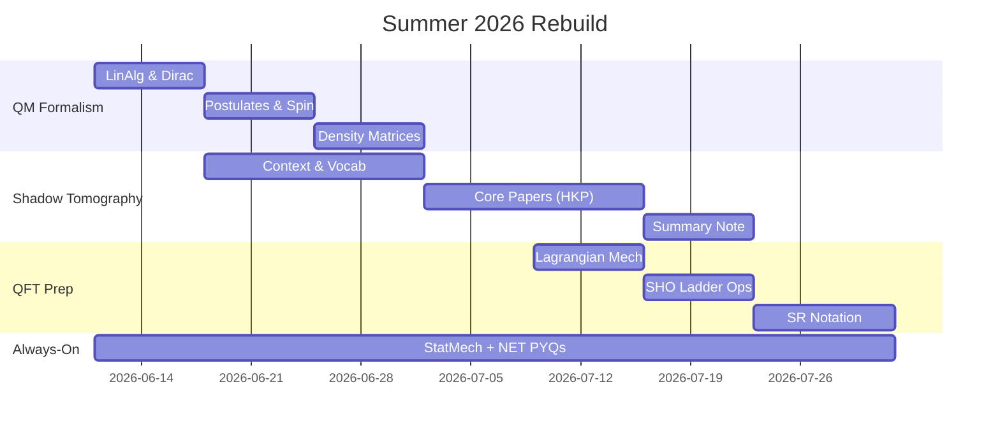

# 🎯 Operation Rebuild — Summer 2026
> [!abstract] Mission
> Rebuild QM foundations through the **finite-dimensional / quantum-information route**, become conversant in **Shadow Tomography**, arrive at 7th sem **QFT-ready**, and keep a maintenance dose of **Stat Mech + NET PYQs**.
> **Window:** 11 June → 1 August (~7 weeks) · **Daily budget:** 6–7 focused hrs

---

## 🧭 The One Insight That Drives Everything
> [!important] Shadow tomography ≠ potential wells
> It needs: **linear algebra, Dirac notation, density matrices, measurement/POVMs, qubits, tensor products, basic statistics.**
> This is *exactly* the PH3102 formalism I'm weak in. **One path, two goals.**

---

## 🚨 Goal 0 — Damage Control (Do in next 72 hours)
- [ ] 📧 Meet/email the QM instructor — be honest: *"I'm rebuilding density-matrix formalism first, here's my 7-week plan, may I check in biweekly?"*
- [ ] 📅 Lock a **biweekly 30-min check-in** slot with him (4 meetings total)
- [ ] 🏠 Confirm hostel/campus stay logistics for the vacation
- [ ] 📥 Download all materials (see [[#📚 Resource Vault]])

> [!tip] Why this works
> Recommendation letters are written for **trajectory + consistency**, not perfection. Four honest check-ins > one fake "I read everything."

---

## 🥇 Goal 1 — QM Formalism Rebuild (Weeks 1–3, ~3 hrs/day)
*The quantum-information route: matrices first, wavefunctions later.*

### Week 1 (Jun 11–17) — Linear Algebra as QM's Language
- [ ] Complex vector spaces, inner products, Dirac bra-ket notation
- [ ] Hermitian & unitary operators, eigenvalues, spectral decomposition
- [ ] Commutators, simultaneous diagonalization
- [ ] 📺 Watch: MIT 8.05 Lec 1–4 (Barton Zwiebach, OCW)
- [ ] 📖 Read: Nielsen & Chuang §2.1 *or* Sakurai Ch. 1
- [ ] ✍️ Solve: 15 problems on operator algebra

### Week 2 (Jun 18–24) — Postulates, Spin-½, Measurement
- [ ] The 4 postulates of QM (state, evolution, measurement, composite systems)
- [ ] Spin-½ / two-level systems, Pauli matrices, Bloch sphere
- [ ] Stern–Gerlach as the *defining* QM experiment
- [ ] Projective measurements → **POVMs** (critical for shadow tomography!)
- [ ] Expectation values, uncertainty relations (operator form)
- [ ] ✍️ Solve: 15 problems on spin systems & measurement
- [ ] 🤝 **Check-in #1 with instructor** — show roadmap, ask 3 prepared questions

### Week 3 (Jun 25–Jul 1) — Density Matrices & Tensor Products
- [ ] Pure vs mixed states, density operator ρ, properties (Tr ρ = 1, ρ ≥ 0)
- [ ] Tensor products, composite systems, partial trace, reduced states
- [ ] Entanglement basics, Bell states
- [ ] Time evolution: Schrödinger vs Heisenberg picture (light touch)
- [ ] 📖 Read: Nielsen & Chuang §2.2–2.4
- [ ] ✍️ Solve: 12 problems on density matrices
- [ ] 🧪 Checkpoint quiz: can I compute ⟨A⟩ = Tr(ρA) cold? If no → repeat before moving on

---

## 🥈 Goal 2 — Shadow Tomography (Weeks 2–6, ~2 hrs/day, starts AFTER Wk-1 algebra)

### Phase A (Wk 2–3) — Context & Vocabulary
- [ ] What is quantum state tomography? Why is full tomography exponentially hard?
- [ ] 📖 Preskill Ph219 lecture notes — chapters on states & measurement
- [ ] 📺 Any intro talk by Hsin-Yuan (Robert) Huang on classical shadows (YouTube)
- [ ] ✍️ Write a 1-page note: *"The tomography problem in my own words"*

### Phase B (Wk 4–5) — The Core Papers
- [ ] 📄 **Huang, Kueng, Preskill (2020)** — *"Predicting many properties of a quantum system from very few measurements"* (Nature Physics) — read 3 passes:
    - [ ] Pass 1: abstract, figures, conclusions only
    - [ ] Pass 2: the protocol (random unitaries → measure → classical shadow → median-of-means)
    - [ ] Pass 3: the guarantees (sample complexity bounds; skim proofs)
- [ ] 📄 Skim **Aaronson (2018)** — *"Shadow Tomography of Quantum States"* — concept level only
- [ ] 📄 Optional: Elben et al. (2023), *"The randomized measurement toolbox"* (review)
- [ ] 💻 Optional but high-impact: reproduce a toy classical-shadow estimate of a 1-qubit state in Python/Qiskit
- [ ] 🤝 **Check-in #2** (~Jul 8): present Pass-2 understanding, ask about what HE wants from this reading

### Phase C (Wk 6) — Deliverable
- [ ] ✍️ Write a **3–5 page summary note** (this becomes your proof-of-work for the letter)
- [ ] 🤝 **Check-in #3** (~Jul 22): walk him through the note; ask: *"Could this grow into a project/thesis direction?"*

> [!success] Definition of Done
> I can explain to a classmate: (1) why full tomography is hopeless, (2) what a classical shadow is, (3) why median-of-means is used, (4) what the sample-complexity result says.

---

## 🥉 Goal 3 — QFT (PH4106) Launch-Pad (Weeks 5–7, ~2 hrs/day)
*Only the 3 pillars QFT actually assumes:*

### Pillar 1 — Lagrangian/Hamiltonian Mechanics (Wk 5)
- [ ] Action principle, Euler–Lagrange equations
- [ ] Noether's theorem (symmetry ↔ conservation) — *this is half of QFT culture*
- [ ] 📖 Goldstein Ch. 1–2 or Landau Mechanics Ch. 1

### Pillar 2 — SHO via Ladder Operators (Wk 6)
- [ ] a, a†, number operator, spectrum — **derive it fully by hand twice**
- [ ] Coherent states (light touch)
> [!note] Field quantization = infinitely many SHOs. Master this and KG quantization will feel familiar.

### Pillar 3 — Special Relativity Notation (Wk 7)
- [ ] 4-vectors, metric η, index gymnastics, Lorentz transformations
- [ ] E² = p²c² + m²c⁴ → motivation for Klein–Gordon
- [ ] 📖 First chapter of any QFT book (Huang / Peskin §2.1) — just notation

### Bonus (only if ahead of schedule)
- [ ] Wave mechanics catch-up: infinite well, tunneling, hydrogen atom (Griffiths Ch. 2, 4) — needed more for **NET** than for QFT

---

## 🛡️ Goal 4 — Stat Mech + NET (Maintenance dose, ~1 hr/day, all weeks)
- [ ] Mon/Wed/Fri: **10 NET PYQs** on the topic studied that week (QM weeks → QM PYQs)
- [ ] Tue/Thu: 1 hr Stat Mech rebuild — micro/canonical ensembles, partition function, ideal gas (Reif or Pathria, slow pace)
- [ ] Sun: review error log of the week's wrong PYQs
- [ ] ❗ Find out the **official repeat/backlog procedure** for the failed Stat Mech course — deadline & format

> [!warning] Boundary
> NET coaching-style full prep is **deferred** to next academic year. This vacation, NET = PYQ practice on current topics only. Don't let guilt expand this goal.

---

## 📅 Daily Template
| Block | Time | What |
|---|---|---|
| 🌅 Deep Work | 3 hrs | Goal 1 (Wk 1–3) → Goal 3 (Wk 5–7) |
| 🌞 Reading | 2 hrs | Goal 2 — Shadow tomography |
| 🌙 Drill | 1 hr | Goal 4 — PYQs / Stat Mech |
| 🛌 | — | **1 full rest day per week. Non-negotiable.** |

---

## 🗓️ Master Timeline

---

## 🤝 Instructor Check-in Tracker
- [ ] #1 (~Jun 20) — Show plan, 3 prepared questions
- [ ] #2 (~Jul 8) — Explain classical-shadow protocol
- [ ] #3 (~Jul 22) — Deliver summary note, ask about project direction
- [ ] #4 (~Aug 1) — Wrap-up; ask what to focus on alongside 7th sem

---

## 📚 Resource Vault
- **QM formalism:** Nielsen & Chuang Ch. 1–2 · Sakurai Ch. 1 · MIT 8.05 OCW (Zwiebach) · Susskind *Theoretical Minimum: QM*
- **Shadow tomography:** Huang–Kueng–Preskill, Nat. Phys. 16, 1050 (2020) · Aaronson, STOC 2018 · Preskill Ph219 notes · Elben et al. 2023 review
- **QFT prep:** Goldstein Ch. 1–2 · Griffiths QM Ch. 2 (SHO) · Peskin §2.1 (notation)
- **Stat Mech:** Reif (gentle) → Pathria · **NET:** previous years' papers (Physical Sciences)

---

## 🧪 Weekly Review (every Sunday)
- [ ] What did I actually finish vs plan?
- [ ] One thing I can now explain that I couldn't last week: ___
- [ ] Am I behind? → Cut from Goal 4 first, then Goal 3 bonus — **never** from Goal 2 check-ins
- [ ] Energy/mood check (1–5): ___

> [!quote] Anchor
> The recommendation letter is earned by **showing up four times with real progress** — not by knowing everything. Progress > perfection.
