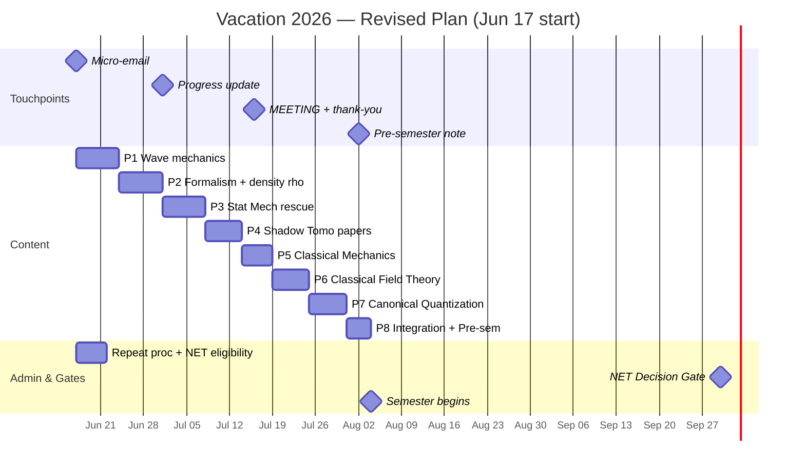

# 🔬 Three Goals. One Vacation. One Plan. — REVISED
**IISER Kolkata · BS-MS Year 4 Prep · June 17 – August 4, 2026**

> [!abstract]+ The Three Goals
> | Priority | Goal | Why It Matters | Deadline |
> |---|---|---|---|
> | 🥇 | **Instructor relationship** via Shadow Tomography | Recommendation letter — the scarcest asset for a low-CGPA student | 4 touchpoints, Jun–Aug |
> | 🥈 | **CSIR NET** Physical Sciences | Funded PhD path independent of CGPA | Gate decision Sep 30 → Dec 2026 or Jun 2027 |
> | 🥉 | **QFT Survival** (PH4106) + Stat Mech backlog | Don't fail another core course | Aug 4 / repeat exam |

> [!important]+ Operating Principles
> 1. **The relationship is the mission.** Study can slip; the four touchpoints never slip.
> 2. **Claim less, write sooner.** Never delay contact waiting to "deserve" it.
> 3. **The plan that survives a bad week beats the perfect plan that gets abandoned.**
> 4. **Weekends = job-meeting days → 60-min micro-sessions only. The cap IS the plan.**
> 5. **49 days, not 54.** Five days were lost; the Cut Order absorbs it. Protected weeks 🔒 never compress.

---

## 📧 The Four Touchpoints (NON-NEGOTIABLE)

### Touchpoint 1 — Micro-email · **Send TONIGHT, Jun 17**
*Ends the silence. Locks his calendar 4 weeks out. Every sentence true today.*

```
Subject: Shadow Tomography — quick update & meeting request

Dear Prof. [Name],

Thank you again for suggesting Shadow Tomography. A quick update:
I am on campus through the vacation and have begun reviewing the
prerequisite quantum mechanics (operator formalism, then density
matrices) before going into the Huang–Kueng–Preskill paper.

Could I request a short meeting around mid-July to discuss what
I have understood? I will send a progress note before then.

With regards,
[Your name]
```

### Touchpoint 2 — Progress update · **Jul 1**

```
Subject: Re: Shadow Tomography — progress update

Dear Prof. [Name],

A short update as promised: I have worked through density matrices,
mixed states, partial trace, and measurement theory, and have started
the Huang–Kueng–Preskill (2020) paper. A few terms are new to me
([list 2–3, e.g., Clifford group, shadow norm]) — I am working
through them and will bring a one-page summary to our meeting.

Could we confirm [proposed date ~Jul 16]?

With regards,
[Your name]
```

> [!tip] Fallback nudge
> If no reply by **Jun 30**, send a one-line: "Just confirming you received my note — would [Jul 16] work for a short meeting?" The meeting is the spine of the whole letter goal.

### Touchpoint 3 — **The Meeting · ~Jul 16**
- [ ] Bring: 1-page synthesis + 5–6 written questions + notebook
- [ ] Within 1 hour after: write down everything discussed
- [ ] **Same evening:** 3-line thank-you email summarizing what you'll do next *(most students skip this — don't)*

### Touchpoint 4 — Pre-semester note · **Aug 2**
- [ ] Short email: what you did with his guidance + one good question
- [ ] Ask: *"Could this grow into a reading project alongside the semester?"*
  *(This sentence converts vacation reading into ongoing mentorship → the letter.)*

---

## 🏛️ Admin Tasks (Week 1 — DO NOT SKIP · now 🔒 protected)
- [ ] **By Jun 22:** Find the official Stat Mech **repeat/supplementary procedure** — format, registration deadline, exam date (academic office / DOAA / seniors). *A missed registration deadline is irreversible — this is now non-negotiable.*
- [ ] **By Jun 22:** Verify CSIR NET **Dec 2026 eligibility** for BS-MS 4th year at csirnet.nta.nic.in — screenshot the rule
- [ ] **By Jun 30:** If a repeat exam date exists, work backwards and reserve prep slots — a cleared backlog protects CGPA *and* morale

---

## 🗓️ Master Timeline



*🔒 = protected by the Cut Order — never compressed. Weekends = micro-days (60 min).*

---

## 📅 Phase 1 — Jun 17–23 · QM Wave Mechanics
**Serves:** CSIR NET (QM) · Shadow Tomo (prerequisite) · QFT (intuition)
**Source:** Griffiths Ch 1–2

| Day | Date | Load | Topic | Source | Self-Test |
|---|---|---|---|---|---|
| 1 | Jun 17 (Wed) | Full | Wave function ψ, Born rule, normalization, superposition **· 📧 SEND TOUCHPOINT 1** | Griffiths §1.1–1.4 | Normalize ψ = Ae^(−x²) |
| 2 | Jun 18 (Thu) | Full | Schrödinger equation + operators; expectation values ⟨x⟩, ⟨p⟩ | Griffiths §1.4–1.6 | State TDSE from memory; compute ⟨x⟩ for ψ = √(2/L) sin(πx/L) |
| 3 | Jun 19 (Fri) | Full | Uncertainty principle; infinite square well — ψₙ, Eₙ **· 🏛️ Admin tasks underway** | Griffiths §1.6, §2.1–2.2 | Δx·Δp ≥ ℏ/2; write all ψₙ, Eₙ from memory |
| 4 | Jun 20 (Sat) | 🔸 60 min | Harmonic oscillator — ladder operators â, ↠(reading + one example) | Griffiths §2.3 | Derive [â, â†] = 1 |
| 5 | Jun 21 (Sun) | 🔸 60 min | Free particle + wave packets (reading) **· 🧭 Sunday Review #1** | Griffiths §2.4 | Sketch a Gaussian wave packet |
| 6 | Jun 22 (Mon) | Full | Finite well + tunneling **· 🏛️ Admin tasks DONE** | Griffiths §2.5–2.6 | Sketch T(E) for a finite barrier |
| 7 | Jun 23 (Tue) | Full | Review: 5 problems from Ch 1–2 without notes *(+ overflow buffer)* | Griffiths problems | — |

> [!success]+ Checkpoint — Jun 23
> - [ ] ψₙ(x), Eₙ for infinite square well from memory
> - [ ] Ladder operator algebra for the harmonic oscillator
> - [ ] Expectation values: meaning + computation
> - [ ] Uncertainty principle stated and used
> - [ ] ✅ Touchpoint 1 sent · ✅ Admin tasks done

---

## 📅 Phase 2 — Jun 24–30 · Formalism + Density Matrices
**Serves:** CSIR NET (QM) · Shadow Tomography (this phase unlocks it) · QFT (operator language)
**Source:** Sakurai Ch 1 + Nielsen & Chuang §2.1–2.4

| Day | Date | Load | Topic | Source | Self-Test |
|---|---|---|---|---|---|
| 8 | Jun 24 (Wed) | Full | Stern–Gerlach; kets \|ψ⟩, bras ⟨ψ\|, inner product; operators, Hermitian, eigenvalue eqn | Sakurai §1.1–1.4 | Measuring Sₓ on \|+z⟩? Eigenstates of Ŝz |
| 9 | Jun 25 (Thu) | Full | Spin-½ fully: Pauli matrices; two-level systems | Sakurai §1.4 + NC §2.1 | Compute σx\|0⟩ via matrix |
| 10 | Jun 26 (Fri) | Full | Pure density matrix ρ = \|ψ⟩⟨ψ\| — full treatment | NC §2.4.1–2.4.2 | ρ for \|+⟩; verify Tr(ρ)=1, Tr(ρ²)=1 |
| 11 | Jun 27 (Sat) | 🔸 60 min | Mixed states; Tr[Oρ]; pure-vs-mixed test (reading) | NC §2.4.2–2.4.3 | 50/50 mix of \|0⟩,\|1⟩; compute Tr[Zρ] |
| 12 | Jun 28 (Sun) | 🔸 60 min | Tensor products; partial trace (reading) **· 🧭 Sunday Review #2** | NC §2.1.7–2.1.8, §2.4.3 | ρᴬ for Bell state \|Φ⁺⟩ |
| 13 | Jun 29 (Mon) | Full | Partial trace consolidation; why full tomography is hard (~4ⁿ) | NC §2.4.3 | Why n-qubit tomography needs ~4ⁿ params |
| 14 | Jun 30 (Tue) | Full | Open HKP 2020 — Abstract + Intro; list unfamiliar terms *(+ overflow buffer)* | arXiv:2002.08953 | List every unfamiliar term |

> [!success]+ Checkpoint — Jun 30
> - [ ] ρ for any qubit state; compute Tr[Oρ]
> - [ ] Pure (Tr ρ² = 1) vs mixed (Tr ρ² < 1)
> - [ ] One-sentence POVM explanation
> - [ ] Why n-qubit full tomography needs ~4ⁿ parameters

---

## 📅 Phase 3 — Jul 1–7 · Statistical Mechanics Rescue 🔒
**Serves:** CSIR NET (biggest gap) · PH4101 prerequisite · failed-course repeat
**Source:** Pathria & Beale Ch 1–4 (or Garg, Bansal & Ghosh)

> [!danger]+ Protected week
> You failed this course. All 7 days stay. Everything else flexes so this doesn't.
> *Note: weekend days here (Jul 4–5) are still 60-min micro-days — but they stay; they do not get cut.*

| Day | Date | Load | Topic | Self-Test |
|---|---|---|---|---|
| 15 | Jul 1 (Wed) | Full | Laws of thermodynamics; potentials F, G, H **· 📧 SEND TOUCHPOINT 2** | Derive G from F via Legendre transform |
| 16 | Jul 2 (Thu) | Full | Maxwell relations; equations of state; Clausius–Clapeyron | All 4 Maxwell relations from memory |
| 17 | Jul 3 (Fri) | Full | Microcanonical ensemble; S = k_B ln Ω | Ω for N two-state systems at energy E |
| 18 | Jul 4 (Sat) | 🔸 60 min | Canonical ensemble; Z = Σ e^(−βEᵢ); ⟨E⟩ = −∂ ln Z/∂β (reading + one example) | Z and ⟨E⟩ for quantum harmonic oscillator |
| 19 | Jul 5 (Sun) | 🔸 60 min | Grand canonical ensemble; μ; Ξ (reading) **· 🧭 Sunday Review #3** | Derive ⟨N⟩ from Ξ |
| 20 | Jul 6 (Mon) | Full | Quantum statistics: derive FD and BE distributions | Derive FD from grand canonical; sketch n(E) |
| 21 | Jul 7 (Tue) | Full | Ideal Fermi gas at T=0: E_F, DOS, C_V ∝ T *(+ overflow buffer)* | E_F in terms of n; degeneracy pressure |

**Know cold for CSIR NET:**

$$Z = \sum_i e^{-\beta E_i}, \quad \langle E \rangle = -\frac{\partial \ln Z}{\partial \beta}, \quad F = -k_BT \ln Z$$

$$\bar{n}_{FD} = \frac{1}{e^{\beta(\varepsilon-\mu)}+1}, \quad \bar{n}_{BE} = \frac{1}{e^{\beta(\varepsilon-\mu)}-1}$$

> [!success]+ Checkpoint — Jul 7
> - [ ] Z → ⟨E⟩, ⟨E²⟩, C_V for a given system
> - [ ] All 4 thermodynamic potentials + natural variables
> - [ ] FD distribution derived from grand canonical ensemble
> - [ ] Fermi energy formula + physical meaning
> - [ ] ✅ Touchpoint 2 sent

---

## 📅 Phase 4 — Jul 8–13 · Shadow Tomography Papers
**Serves:** Instructor relationship → recommendation letter
**Source:** HKP 2020 (arXiv:2002.08953) + Aaronson 2018 (arXiv:1809.01879)

| Day | Date | Load | Topic |
|---|---|---|---|
| 22 | Jul 8 (Wed) | Full | HKP §1 in full: problem setting, sample-complexity claim, notation |
| 23 | Jul 9 (Thu) | Full | HKP §2: Classical Shadow Protocol — step by step |
| 24 | Jul 10 (Fri) | Full | HKP §2 cont.: Clifford group, snapshot state, median-of-means |
| 25 | Jul 11 (Sat) | 🔸 60 min | HKP §3: Main theorem — shadow norm (reading) |
| 26 | Jul 12 (Sun) | 🔸 60 min | HKP §3 cont.: local Pauli result, why locality helps **· 🧭 Sunday Review #4** |
| 27 | Jul 13 (Mon) | Full | **Finale:** 1-page synthesis + 5–6 questions + email confirming meeting *(HKP §4 apps + Aaronson Thm 1 = if time permits)* |

**The Classical Shadow Protocol — memorize:**
1. Sample random Clifford unitary U (uniformly)
2. Apply U to ρ → UρU†
3. Measure in computational basis → outcome b ∈ {0,1}ⁿ
4. Record classical shadow: ŝ = U†\|b⟩⟨b\|U (stored classically)
5. Repeat T times → {ŝ₁, …, ŝ_T}
6. Estimate Tr[Oᵢρ] ≈ median-of-means of {Tr[Oᵢ ŝₜ]}

**Why exponentially better:** for local Pauli observables on k qubits, T = O(log M · 4ᵏ/ε²) — independent of system size n. Full tomography: ~4ⁿ.

**1-page synthesis structure:**
1. **The Problem** (2 sentences): full tomography ~4ⁿ; we only need M expectation values
2. **The Protocol** (3 sentences): random Cliffords → snapshots → median-of-means
3. **The Key Result** (2 sentences): T = O(log M · 4ᵏ/ε²); independent of n
4. **Why It Matters** (2 sentences): VQE, quantum chemistry, near-term devices
5. **Open Questions** (1 sentence): beyond Cliffords, noise robustness

> [!success]+ Checkpoint — Jul 13
> - [ ] Protocol explained in 3 minutes without notes
> - [ ] Main result stated; the 4ᵏ explained physically
> - [ ] 1-page synthesis clean and done
> - [ ] Meeting date confirmed

---

## 📅 Phase 5 — Jul 14–18 · Classical Mechanics
**Serves:** CSIR NET (CM) · QFT (Lagrangian formalism — direct foundation)
**Source:** Taylor Ch 7, 13 (or Goldstein Ch 1–2)

| Day | Date | Load | Topic | Self-Test |
|---|---|---|---|---|
| 28 | Jul 14 (Mon) | Full | Lagrangian L = T−V; generalized coordinates; Euler–Lagrange | Pendulum EOM from L |
| 29 | Jul 15 (Tue) | Full | Canonical momentum; H = Σpᵢq̇ᵢ − L · *evening: reread synthesis, meeting prep* | H for 1D harmonic oscillator |
| 30 | Jul 16 (Wed) | Light | **🎯 TOUCHPOINT 3: INSTRUCTOR MEETING** · notes within 1 hr · **thank-you email same evening** | — |
| 31 | Jul 17 (Thu) | Full | Hamilton's equations; phase space; Liouville's theorem | Verify Hamilton's eqs for pendulum |
| 32 | Jul 18 (Fri) | Full | Poisson brackets {f,g}; {qᵢ,pⱼ}=δᵢⱼ; canonical transformations *(central force + Kepler + normal modes = if time permits)* | Show {H,qᵢ} = q̇ᵢ |

> [!important]+ The Poisson Bracket → Commutator Bridge
> $$\{q_i, p_j\}_{\text{cl}} = \delta_{ij} \quad\xrightarrow{\text{quantize}}\quad [\hat{q}_i, \hat{p}_j] = i\hbar\,\delta_{ij}$$
> This exact step becomes canonical quantization of fields. Understand it here → Phase 7 needs no magic.

> [!success]+ Checkpoint — Jul 18
> - [ ] EOM from any given Lagrangian
> - [ ] Phase space + Liouville's theorem
> - [ ] Poisson brackets ↔ commutators connection
> - [ ] ✅ Meeting held · notes written · thank-you sent

---

## 📅 Phase 6 — Jul 19–24 · Classical Field Theory
**Serves:** QFT PH4106 (direct prep) · CSIR NET (Math Methods)
**Source:** David Tong — QFT Notes Ch 1 (damtp.cam.ac.uk/user/tong/qft.html)

| Day | Date | Load | Topic | Tong |
|---|---|---|---|---|
| 33 | Jul 19 (Sat) | 🔸 60 min | Fields as N→∞ coupled oscillators; Lagrangian density ℒ (reading) | §1.1 |
| 34 | Jul 20 (Sun) | 🔸 60 min | Action S = ∫d⁴x ℒ; Euler–Lagrange for fields (reading) **· 🧭 Sunday Review #5** | §1.1–1.2 |
| 35 | Jul 21 (Mon) | Full | KG Lagrangian → derive KG; π(x) = φ̇(x); redo derivation cold | §1.2 |
| 36 | Jul 22 (Tue) | Full | Noether's theorem: symmetry → conserved current ∂_μ j^μ = 0 | §1.3 |
| 37 | Jul 23 (Wed) | Full | Energy-momentum tensor T^μν + complex scalar, U(1) charge | §1.3–1.4 |
| 38 | Jul 24 (Thu) | Full | Tong Ch 1 problems: derive KG, derive T^μν, verify Noether *(+ overflow buffer)* | §1 ex. |

**Know this derivation cold:**
$$\mathcal{L} = \tfrac{1}{2}\partial_\mu\phi\,\partial^\mu\phi - \tfrac{1}{2}m^2\phi^2 \;\xrightarrow{\text{E-L}}\; (\partial_\mu\partial^\mu + m^2)\phi = 0$$

> [!success]+ Checkpoint — Jul 24
> - [ ] KG equation from its Lagrangian in under 5 minutes
> - [ ] Noether's theorem stated and applied to derive T^μν
> - [ ] Field = mechanical system with ∞ degrees of freedom — intuitive

---

## 📅 Phase 7 — Jul 25–30 · Canonical Quantization + CSIR QM 🔒
**Serves:** QFT PH4106 (the core) · CSIR NET (perturbation theory)
**Source:** Tong Ch 2 + Griffiths Ch 6

> [!important]+ The Central Analogy — The Key to QFT
> | QM Harmonic Oscillator | Quantum Field Theory |
> |---|---|
> | Position x̂, momentum p̂ | Field φ̂(x), conjugate momentum π̂(x) |
> | [x̂, p̂] = iℏ | [φ̂(x), π̂(y)] = iδ³(x−y) |
> | â, ↠with [â,â†]=1 | âₚ, âₚ† with [âₚ,âₖ†]=(2π)³δ³(p−k) |
> | Ĥ = ω(â†â + ½) | Ĥ = ∫d³p/(2π)³ Eₚ âₚ†âₚ (normal ordered) |
> | Ground state \|0⟩ | Vacuum \|0⟩ (not empty — fluctuations) |
> | Fock states \|n⟩ | Particle states \|p₁, p₂, …⟩ |

> [!danger]+ Protected core
> Days Jul 25–28 (canonical quantization) are 🔒. Weekend Jul 25–26 are micro-days but stay — do the conceptual reading; push the heavy derivation to Mon Jul 27.

| Day | Date | Load | Topic | Source |
|---|---|---|---|---|
| 39 | Jul 25 (Sat) | 🔸 60 min | Deep review: â, â†, [â,â†]=1; ladder algebra (reading + 1 example) | Griffiths §2.3 |
| 40 | Jul 26 (Sun) | 🔸 60 min | Canonical quantization concept: promote φ, π to operators (reading) **· 🧭 Sunday Review #6** | Tong §2.1 |
| 41 | Jul 27 (Mon) | Full | Equal-time commutator; mode expansion; [φ,π]=iδ³ ↔ [âₚ,âₖ†]=(2π)³δ³(p−k) | Tong §2.1 |
| 42 | Jul 28 (Tue) | Full | Fock space; vacuum; particle states; normal ordering; Casimir effect | Tong §2.2–2.4 |
| 43 | Jul 29 (Wed) | Full | CSIR QM: time-independent perturbation theory, 1st + 2nd order | Griffiths §6.1–6.2 |
| 44 | Jul 30 (Thu) | Full | CSIR QM: degenerate perturbation theory; Stark + Zeeman; 10 PYQ (2022–24) *(+ overflow buffer)* | Griffiths §6.2–6.5 + past papers |

> [!success]+ Checkpoint — Jul 30
> - [ ] Quantize the Klein–Gordon field from scratch on paper
> - [ ] Fock states; how the vacuum differs from "empty"
> - [ ] First-order perturbation energy corrections
> - [ ] ≥ 10 CSIR NET QM questions attempted

---

## 📅 Phase 8 — Jul 31 – Aug 3 · Integration + Pre-Semester (compressed)

| Day | Date | Load | Topic | Goal |
|---|---|---|---|---|
| 45 | Jul 31 (Fri) | Full | Dirac equation familiarity + Tong Ch 1 read-through (merged) | QFT |
| 46 | Aug 1 (Sat) | 🔸 60 min | 10 CSIR NET Stat Mech previous-year questions | NET |
| 47 | Aug 2 (Sun) | 🔸 60 min | Map PH4106 syllabus → Tong sections **· 📧 SEND TOUCHPOINT 4** ("reading project?") **· 🧭 Sunday Review #7** | QFT + Letter |
| 48 | Aug 3 (Mon) | Full | 10 CSIR NET Classical Mechanics PYQ; organize Obsidian vault; top 5 weakest → first-week targets | All |
| 49 | Aug 4 (Tue) | — | **Semester begins** 🎓 | — |

**PH4106 Syllabus → Tong Mapping (keep open every lecture):**

| PH4106 Topic | Tong Section |
|---|---|
| Particles to fields; long-wavelength approximation | §1.1 |
| Scalar field theory; Klein–Gordon equation | §1.2 |
| Lagrangian formalism; symmetries; Noether theorem | §1.3–1.4 |
| Scalar field quantization | §2.1–2.2 |
| S-matrix; Dyson expansion; Wick theorem | §3.1–3.3 |
| Dirac equation; Lorentz transformations; spinors | §4.1–4.3 |
| EM field quantization; QED basics | §6.1–6.2 |
| Casimir effect | §2.4 |
| Klein paradox | §4.3 |
| Lamb shift; anomalous magnetic moment | §6.3–6.4 |

> [!success]+ Checkpoint — Aug 4
> - [ ] KG equation derived + quantized on paper
> - [ ] PH4106 ↔ Tong mapping complete
> - [ ] ≥ 20 CSIR PYQs done total (QM + SM + CM)
> - [ ] Tong notes downloaded offline
> - [ ] ✅ Touchpoint 4 sent · vault organized

---

## ⏰ Daily Study Protocol

> [!note]+ Full Days — Weekdays (3 hours, non-negotiable)
> | Block | Duration | Mode |
> |---|---|---|
> | Morning | 90 min | New content — pen + paper, phone in another room |
> | Break | 30 min | Walk outside. No screen. Mandatory. |
> | Afternoon | 90 min | Problems, derivations, self-tests |
> | Evening | 5 min | Write tomorrow's ONE specific task. Close everything. |

> [!note]+ Micro-Days — Weekends (job-meeting days — 60 min)
> | Block | Duration | Mode |
> |---|---|---|
> | Around the meeting | 50 min | Reading + ONE worked example. Nothing more. |
> | Close | 10 min | One-line note: what stuck, what didn't. |

**Rules:**
- [ ] Handwritten notes for all physics. Typing is for organizing, not learning.
- [ ] End of day: 3 things understood + 1 thing unclear.
- [ ] Stuck 20 min → second source. Stuck 40 min → note it, move on.
- [ ] Never advance past a section you can't recall without looking.

---

## 🛡️ Risk Controls

### 🧭 Sunday Review — 30 min, every Sunday (folds into the 60-min weekend cap)
- [ ] Plan vs actual: which self-tests passed *cold*?
- [ ] One thing I can explain now that I couldn't last Sunday: ___
- [ ] Behind? → apply the Cut Order. **Never abandon the plan because one phase slipped.**
- [ ] Mood/energy (1–5): ___ → two weeks ≤2 = reduce load, keep touchpoints

### ✂️ The Cut Order (when behind, cut top-down)
| Cut first | Item |
|---|---|
| 1 | Phase 8 Dirac familiarity (already merged) |
| 2 | NET PYQ counts (20 → 12 is fine) |
| 3 | Phase 5 extras (Kepler details, normal modes — already "if time permits") |
| 4 | Phase 4 HKP §4 applications + Aaronson Thm 1 |
| 5 | Phase 6–7 depth (derive KG once, not "cold in 5 min") |
| ⛔ NEVER | The 4 touchpoints · Admin/repeat-exam registration · Stat Mech week (Jul 1–7) · Quantization core (Jul 25–28) |

### 🔁 Rolling Buffer Rule
Each phase's **final full day doubles as its overflow day**. Spillover beyond that goes to the next Sunday Review for triage — it does **not** silently push the next phase.

### 🛟 Freeze-Breaker Protocol (the 20-day freeze must not recur)
If zero work for 2 consecutive days:
1. Day 3's task = smallest possible unit — one worked example, 25 minutes
2. Re-read the Anchor quote at the bottom
3. **Touchpoints stay on schedule even if study is behind** — the relationship is the mission

---

## ⚖️ CSIR NET Decision Gate — September 30, 2026
Take ONE full timed previous-year paper.

| Outcome | Decision |
|---|---|
| Within striking distance of recent cutoffs | ✅ Commit to **Dec 2026** → November mock month proceeds |
| Clearly below | 🔁 Target **June 2027** → November's 3 hr/day becomes coursework + Stat Mech repeat + foundations. Same syllabus, zero wasted work |

> [!info]+ Semester Continuation (Aug–Dec, conditional on the gate)
> | Month | Lectures cover | CSIR self-study | Daily |
> |---|---|---|---|
> | Aug | PH4106 (QFT), PH4101 (CMP intro) | EM Theory: Griffiths EM Ch 1–7 | 1.5 h |
> | Sep | PH4106 cont. | Nuclear & Particle basics; Atomic & Molecular · **Sep 30: GATE** | 1.5 h |
> | Oct | PH4101 deep | Condensed Matter; QM + SM practice | 2 h |
> | Nov | All | If Dec attempt: ≥5 full timed mocks | 3 h |
> | Dec | — | **CSIR NET exam** (if gate passed) 🎯 | — |
>
> **Attending PH4106 and PH4101 attentively IS CSIR prep** — the goals are not in competition.

---

## 📚 Master Resource List
| Goal | Resource | Access | Use |
|---|---|---|---|
| QM basics | Griffiths — *Intro to QM* | Library/PDF | Ch 1–2 (P1), Ch 6 (P7) |
| QM formalism | Sakurai — *Modern QM* | Library/PDF | Ch 1; §3.4 (density matrix) |
| Shadow Tomo | Nielsen & Chuang Ch 2 | Free PDF | §2.1–2.4 |
| Shadow Tomo | HKP 2020 — arXiv:2002.08953 | arXiv | Full paper — primary |
| Shadow Tomo | Aaronson 2018 — arXiv:1809.01879 | arXiv | Intro + Theorem 1 |
| Stat Mech | Pathria & Beale; Garg/Bansal/Ghosh | Library | Ch 1–4 |
| CM | Taylor Ch 7, 13 (or Goldstein 1–2) | Library | Phase 5 |
| NET practice | Previous papers 2019–2024 | csirnet.nta.nic.in | Mandatory |
| QFT | David Tong — QFT Notes | damtp.cam.ac.uk/user/tong/qft.html | Ch 1, 2, 4 |
| QFT backup | Lancaster & Blundell | Library | Gentler than Weinberg |

---

## ✅ Master Checklist
### This week
- [ ] **Tonight (Jun 17):** 📧 Touchpoint 1 sent + Griffiths §1.1 — normalize ψ = Ae^(−x²)
- [ ] **Jun 21:** 🧭 First Sunday Review
- [ ] **Jun 22:** 🏛️ Repeat procedure + NET eligibility confirmed
- [ ] **Jun 23:** Phase 1 checkpoint passed

### Vacation milestones
- [ ] Jun 30 — P2 done
- [ ] Jul 1 — 📧 Touchpoint 2 sent
- [ ] Jul 7 — P3 Stat Mech checkpoint passed 🔒
- [ ] Jul 13 — Synthesis done, meeting confirmed
- [ ] Jul 16 — 🎯 Meeting + same-evening thank-you
- [ ] Jul 24 — KG derived from its Lagrangian
- [ ] Jul 28 — Canonical quantization done 🔒
- [ ] Aug 2 — 📧 Touchpoint 4: "reading project?" asked
- [ ] Aug 3 — Vault organized, Tong mapping complete

### Semester gates
- [ ] Sep 30 — ⚖️ NET Decision Gate → Dec 2026 or Jun 2027
- [ ] Nov — mocks (if Dec attempt) OR foundations (if Jun 2027)
- [ ] Dec — 🎯 CSIR NET (conditional)

---

> [!quote] Anchor
> The plan that survives a bad week beats the perfect plan that gets abandoned.
> Four emails and one meeting earn the letter — the physics earns the *next* one.

*REVISED · 2026-06-17 · Next action: Touchpoint 1 email + Griffiths §1.1, tonight.*
