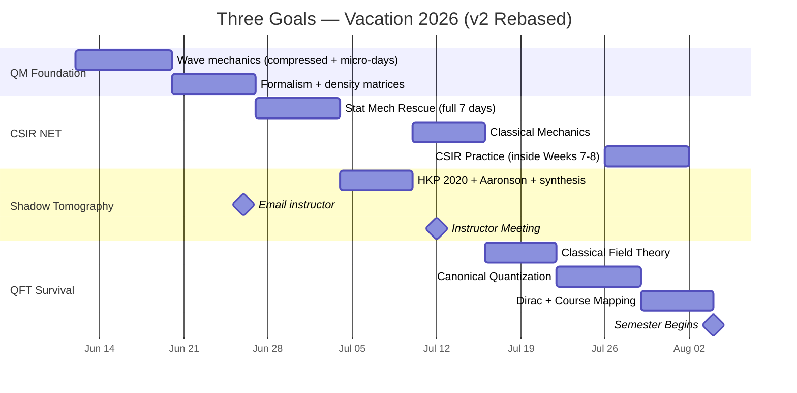

# 🔬 Three Goals. One Vacation. One Plan. — v2 (REBASED)
**IISER Kolkata · BS-MS Year 4 Prep · June 12 – August 4, 2026**
*Rebased on June 12 (afternoon). Jun 13–15 = part-time job meetings → micro-sessions only.*

---

> [!abstract]+ The Three Goals (unchanged)
> | Priority | Goal | Why It Matters | Deadline |
> |---|---|---|---|
> | 🥇 | **CSIR NET** Physical Sciences | Only reliable path to funded PhD with a low CGPA | Dec 2026 |
> | 🥈 | **Shadow Tomography** | Instructor mentorship → recommendation letter | Mid-July meeting |
> | 🥉 | **QFT Survival** (PH4106) | Don't fail another core course | Aug 2026 |

---

> [!important]+ What Changed in v2 — Read This First
> | Change | Old | New | Why |
> |---|---|---|---|
> | Start date | Jun 10 | **Jun 12 (today, PM)** | Reality |
> | Jun 13–15 | Full study days | **60-min micro-sessions** | Job meetings |
> | Week 1 (wave mechanics) | 7 days | **Jun 12–19** (3 micro + 4 full) | Lightest week absorbs the hit |
> | Instructor email | Jun 23 | **Jun 26** | Density matrices must be genuinely done first |
> | Stat Mech week | 7 days | **7 days (Jun 27–Jul 3)** | Non-negotiable. Untouched. |
> | Shadow Tomo papers | 7 days | **6 days (Jul 4–9)** | Synthesis + questions merged into one day |
> | Classical Mechanics | 7 days | **6 days (Jul 10–15)** | Central force + small oscillations merged |
> | Classical Field Theory | 7 days | **6 days (Jul 16–21)** | Adjacent Tong §1 topics merged |
> | Canonical Quantization | Jul 22–28 | **Jul 22–28 — IDENTICAL** | ✅ Back on original schedule here |
> | Week 8 / Pre-semester | Jul 29–Aug 4 | **Jul 29–Aug 3 — IDENTICAL** | ✅ Lands exactly as planned |
> | Instructor meeting | Jul 12 | **Jul 12 — unchanged** 🎯 | |
> | Semester begins | Aug 4 | **Aug 4 — unchanged** | |
>
> **Net result:** 4.5 lost days absorbed entirely by Weeks 1–6 compression. Zero content dropped. By July 22 you are byte-for-byte on the original plan.

---

## 🗓️ Master Timeline (Rebased)



---

## 📧 The Instructor Email — New Send Date: June 26

> [!danger]+ Still Do NOT Email Yet
> Same logic as before, shifted 3 days: on **June 26** you will have genuinely studied density matrices, measurements, and opened HKP 2020. Every word below will be true on that day. The mid-July meeting timeline is completely unaffected — June 26 still gives the instructor 2+ weeks of lead time.

**Send on: June 26 (Day 15 of v2)**

```
Subject: Shadow Tomography — Reading Progress and Meeting Request

Dear Prof. [Name],

I hope you are well. I wanted to update you on the topic of
Shadow Tomography that you suggested. I have been going through
the foundational quantum information formalism — density matrices
and measurement theory — and have started reading the relevant
papers. I would like to schedule a meeting in mid-July to discuss
what I have understood and get your guidance on next steps.

I am on campus from June 9. Please let me know a time convenient
for you.

With regards,
[Your name]
```

> [!tip]+ Why This Email Works
> It claims no more than what will be true on June 26. No apology for the gap. No over-explanation. Just: progress + meeting request. Short, professional, done.

---

## 📅 Week-by-Week Plan (v2)

---

### 🗓️ Phase 1 — June 12–19 · QM Wave Mechanics (Compressed)

**Serves:** CSIR NET (QM) · Shadow Tomo (prerequisite) · QFT (intuition)
**Source:** Griffiths Ch 1–2

> [!warning]+ Jun 13–15: Micro-Session Protocol (Job Meeting Days)
> **60 minutes, evening, that's it.** No guilt about the cap — the cap IS the plan.
> Reading + one worked example only. No problem sets on these days.
> If a meeting day implodes completely, the buffer is Jun 19's review slot.

| Day | Date | Load | Topic | Source | Self-Test |
|---|---|---|---|---|---|
| 1 | Jun 12 (PM) | ~2.5h | Wave function ψ, Born rule, normalization, superposition | Griffiths §1.1–1.4 | Normalize ψ = Ae^{−x²} |
| 2 | Jun 13 | 🔸 60 min | Schrödinger equation + operators (reading-focused) | Griffiths §1.4–1.5 | State the TDSE from memory |
| 3 | Jun 14 | 🔸 60 min | Expectation values ⟨x⟩, ⟨p⟩ — one worked example | Griffiths §1.5–1.6 | Compute ⟨x⟩ for ψ = √(2/L) sin(πx/L) |
| 4 | Jun 15 | 🔸 60 min | Recap Days 1–3 + uncertainty principle (reading) | Griffiths §1.6 | Write Δx·Δp ≥ ℏ/2 + meaning in 2 sentences |
| 5 | Jun 16 | Full | Infinite square well — full solution, ψₙ and Eₙ | Griffiths §2.1–2.2 | Write all ψₙ and Eₙ from memory |
| 6 | Jun 17 | Full | Harmonic oscillator — ladder operators â, â†, levels | Griffiths §2.3 | Derive [â, â†] = 1 from scratch |
| 7 | Jun 18 | Full | Free particle + wave packets + finite well + tunneling | Griffiths §2.4–2.6 | Sketch T(E) for a finite barrier |
| 8 | Jun 19 | Full | Review: 5 problems from Ch 1–2 without notes *(+ catch-up buffer)* | Griffiths problems | — |

> [!success]+ Checkpoint — June 19
> - [ ] ψₙ(x), Eₙ for infinite square well from memory
> - [ ] Ladder operator algebra for the harmonic oscillator
> - [ ] Expectation values: physical meaning + computation
> - [ ] Heisenberg uncertainty principle stated and used

---

### 🗓️ Phase 2 — June 20–26 · Formalism + Density Matrices

**Serves:** CSIR NET (QM) · Shadow Tomography (this phase unlocks it) · QFT (operator language)
**Source:** Sakurai Ch 1 + Nielsen & Chuang §2.1–2.4

| Day | Date | Topic | Source | Self-Test |
|---|---|---|---|---|
| 9 | Jun 20 | Stern-Gerlach; kets \|ψ⟩, bras ⟨ψ\|, inner product | Sakurai §1.1–1.2 | Measuring Sₓ on \|+z⟩ gives what? |
| 10 | Jun 21 | Operators, Hermitian operators, Â\|a⟩ = a\|a⟩ | Sakurai §1.3–1.4 | Eigenvalue eq. for Ŝz; find eigenstates |
| 11 | Jun 22 | Spin-1/2 fully: Pauli matrices; 2-state systems | Sakurai §1.4 + NC §2.1 | Compute σx\|0⟩ via matrix |
| 12 | Jun 23 | Pure density matrix ρ = \|ψ⟩⟨ψ\| — full treatment | NC §2.4.1–2.4.2 | ρ for \|+⟩; verify Tr(ρ)=1, Tr(ρ²)=1 |
| 13 | Jun 24 | Mixed states; Tr[Oρ]; pure-vs-mixed test | NC §2.4.2–2.4.3 | 50/50 mix of \|0⟩,\|1⟩; compute Tr[Zρ] |
| 14 | Jun 25 | Tensor products; partial trace; why tomography is hard | NC §2.1.7–2.1.8, §2.4.3 | Compute ρᴬ for Bell state \|Φ⁺⟩ |
| 15 | Jun 26 | **Open HKP 2020 — Abstract + Intro. SEND INSTRUCTOR EMAIL.** 📧 | arXiv:2002.08953 | List every unfamiliar term |

> [!success]+ Checkpoint — June 26
> - [ ] Can write ρ for any qubit state and compute Tr[Oρ]
> - [ ] Pure (Tr(ρ²)=1) vs mixed (Tr(ρ²)<1) distinction
> - [ ] One-sentence POVM explanation
> - [ ] Why n-qubit full tomography needs ~4ⁿ parameters
> - [ ] ✅ **Instructor email sent**

---

### 🗓️ Phase 3 — June 27 – July 3 · Statistical Mechanics Rescue (FULL 7 DAYS)

**Serves:** CSIR NET (your biggest gap) · PH4101 CMP prerequisite
**Source:** Pathria & Beale Ch 1–4 (or Garg, Bansal & Ghosh)

> [!danger]+ Untouched by the Compression — Deliberately
> You failed Stat Mech. This week keeps every one of its 7 days. Everything else flexed so this didn't have to.

| Day | Date | Topic | Self-Test |
|---|---|---|---|
| 16 | Jun 27 | Laws of thermodynamics; potentials F, G, H | Derive G from F via Legendre transform |
| 17 | Jun 28 | Maxwell relations; equations of state; Clausius-Clapeyron | All 4 Maxwell relations from memory |
| 18 | Jun 29 | Microcanonical ensemble; S = kB ln Ω | Ω for N two-state systems at energy E |
| 19 | Jun 30 | Canonical ensemble; Z = Σ e^{−βEᵢ}; ⟨E⟩ = −∂ ln Z/∂β | Z and ⟨E⟩ for quantum harmonic oscillator |
| 20 | Jul 1 | Grand canonical ensemble; μ; grand partition function | Derive ⟨N⟩ from Ξ |
| 21 | Jul 2 | Quantum statistics: derive FD and BE distributions | Derive FD from grand canonical; sketch n(E) |
| 22 | Jul 3 | Ideal Fermi gas at T=0: EF, DOS, CV ∝ T | EF in terms of n; degeneracy pressure |

**Know cold for CSIR NET:**

$$Z = \sum_i e^{-\beta E_i}, \quad \langle E \rangle = -\frac{\partial \ln Z}{\partial \beta}, \quad F = -k_BT \ln Z$$

$$\bar{n}_{FD} = \frac{1}{e^{\beta(\varepsilon-\mu)}+1}, \quad \bar{n}_{BE} = \frac{1}{e^{\beta(\varepsilon-\mu)}-1}$$

> [!success]+ Checkpoint — July 3
> - [ ] Z → ⟨E⟩, ⟨E²⟩, CV for a given system
> - [ ] All 4 thermodynamic potentials + natural variables
> - [ ] FD distribution derived from grand canonical ensemble
> - [ ] Fermi energy formula + physical meaning

---

### 🗓️ Phase 4 — July 4–9 · Shadow Tomography Papers (6 days)

**Serves:** Instructor relationship → recommendation letter
**Source:** HKP 2020 (arXiv:2002.08953) + Aaronson 2018 (arXiv:1809.01879)

| Day | Date | Topic |
|---|---|---|
| 23 | Jul 4 | HKP §1 in full: problem setting, sample complexity claim, notation |
| 24 | Jul 5 | HKP §2: Classical Shadow Protocol — step by step |
| 25 | Jul 6 | HKP §2 cont.: Clifford group, snapshot state, median-of-means |
| 26 | Jul 7 | HKP §3: Main theorem — shadow norm, local Pauli result, why locality helps |
| 27 | Jul 8 | HKP §4 applications + Aaronson 2018 Intro + Theorem 1 |
| 28 | Jul 9 | **Merged finale:** 1-page synthesis + 5–6 questions + email to confirm meeting date |

**The Classical Shadow Protocol — memorize:**
1. Sample random Clifford unitary U (uniformly)
2. Apply U to ρ → state becomes UρU†
3. Measure in computational basis → outcome b ∈ {0,1}ⁿ
4. Record classical shadow: ŝ = U†|b⟩⟨b|U (a pure state, stored classically)
5. Repeat T times → {ŝ₁, ..., ŝT}
6. Estimate Tr[Oᵢρ] ≈ median-of-means of {Tr[Oᵢ ŝt]}

**Why this is exponentially better:** For local Pauli observables on k qubits, only T = O(log M · 4ᵏ / ε²) rounds needed — independent of total system size n. Compare to ~4ⁿ for full tomography.

**1-page synthesis structure:**
1. **The Problem** (2 sentences): full tomography costs ~4ⁿ; we only need M expectation values
2. **The Protocol** (3 sentences): random Clifford unitaries → snapshot states → median-of-means
3. **The Key Result** (2 sentences): T = O(log M · 4ᵏ/ε²) for local Paulis; independent of n
4. **Why It Matters** (2 sentences): VQE for quantum chemistry; near-term quantum devices
5. **Open Questions** (1 sentence): beyond Clifford circuits, noise robustness

> [!success]+ Checkpoint — July 9
> - [ ] HKP protocol explained in 3 minutes without notes
> - [ ] Main result stated; 4ᵏ explained physically
> - [ ] 1-page synthesis clean and done
> - [ ] Meeting date confirmed by email

---

### 🗓️ Phase 5 — July 10–15 · Classical Mechanics (6 days)

**Serves:** CSIR NET (CM section) · QFT (Lagrangian formalism — direct foundation)
**Source:** Taylor Ch 7, 13 (or Goldstein Ch 1–2)

| Day | Date | Topic | Self-Test |
|---|---|---|---|
| 29 | Jul 10 | Lagrangian L = T−V; generalized coordinates; Euler-Lagrange | Derive pendulum EOM from L |
| 30 | Jul 11 | Canonical momentum; Hamiltonian H = Σpᵢq̇ᵢ − L · *evening: meeting prep — reread synthesis* | H for 1D harmonic oscillator |
| 31 | Jul 12 | **🎯 INSTRUCTOR MEETING** · Bring: synthesis + questions + notebook · *light day otherwise* | Write down everything discussed within 1 hour |
| 32 | Jul 13 | Hamilton's equations; phase space; Liouville's theorem | Verify Hamilton's eqs for pendulum |
| 33 | Jul 14 | Poisson brackets {f,g}; {qᵢ,pⱼ}=δᵢⱼ; canonical transformations | Show {H,qᵢ} = q̇ᵢ |
| 34 | Jul 15 | **Merged:** Central force + Kepler + small oscillations + normal modes | Kepler's 2nd law; normal modes of 2 coupled oscillators |

> [!important]+ The Poisson Bracket → Commutator Bridge
> $$\{q_i, p_j\}_{\text{classical}} = \delta_{ij} \quad\xrightarrow{\text{quantize}}\quad [\hat{q}_i, \hat{p}_j] = i\hbar\delta_{ij}$$
> This exact step becomes canonical quantization of fields in QFT. Understand it here, and Phase 7 requires no magic.

> [!note]+ After the Instructor Meeting
> Write down everything discussed within 1 hour while memory is fresh. What direction did they give? Reading course, research project, or another paper? This determines your post-vacation plan.

> [!success]+ Checkpoint — July 15
> - [ ] EOM from any given Lagrangian
> - [ ] Phase space + Liouville's theorem
> - [ ] Poisson brackets ↔ commutators connection
> - [ ] ✅ Instructor meeting done + notes written same-day

---

### 🗓️ Phase 6 — July 16–21 · Classical Field Theory (6 days)

**Serves:** QFT PH4106 (direct prep) · CSIR NET (Math Methods)
**Source:** David Tong — QFT Notes, Ch 1 (damtp.cam.ac.uk/user/tong/qft.html)

| Day | Date | Topic | Tong |
|---|---|---|---|
| 35 | Jul 16 | Fields as N→∞ coupled oscillators; Lagrangian density ℒ | §1.1 |
| 36 | Jul 17 | **Merged:** Action S = ∫d⁴x ℒ; Euler-Lagrange for fields; KG Lagrangian → derive KG | §1.1–1.2 |
| 37 | Jul 18 | KG consolidation; canonical momentum π(x) = φ̇(x); redo derivation cold | §1.2 |
| 38 | Jul 19 | Noether's theorem: symmetry → conserved current ∂μjμ = 0 | §1.3 |
| 39 | Jul 20 | **Merged:** Energy-momentum tensor Tμν + complex scalar, U(1), conserved charge | §1.3–1.4 |
| 40 | Jul 21 | Tong Ch 1 problems: derive KG, derive Tμν, verify Noether | §1 ex. |

**Know this derivation cold:**
$$\mathcal{L} = \frac{1}{2}\partial_\mu\phi\,\partial^\mu\phi - \frac{1}{2}m^2\phi^2 \xrightarrow{\text{Euler-Lagrange}} (\partial_\mu\partial^\mu + m^2)\phi = 0$$

> [!success]+ Checkpoint — July 21
> - [ ] KG equation from its Lagrangian in under 5 minutes
> - [ ] Noether's theorem stated and applied to derive Tμν
> - [ ] Field = mechanical system with ∞ degrees of freedom — intuitive

> [!note]+ 🎉 As of July 22 you are EXACTLY back on the original schedule.

---

### 🗓️ Phase 7 — July 22–28 · Canonical Quantization + CSIR QM (unchanged)

**Serves:** QFT PH4106 (the core of the course) · CSIR NET (QM — perturbation theory)
**Source:** Tong Ch 2 + Griffiths Ch 6

> [!important]+ The Central Analogy — The Key to QFT
> | QM Harmonic Oscillator | Quantum Field Theory |
> |---|---|
> | Position x̂, momentum p̂ | Field φ̂(x), conjugate momentum π̂(x) |
> | [x̂, p̂] = iℏ | [φ̂(x), π̂(y)] = iδ³(x−y) |
> | Ladder operators â, ↠with [â,â†]=1 | Mode operators âₚ, âₚ† with [âₚ,âₖ†]=(2π)³δ³(p−k) |
> | Ĥ = ω(â†â + ½) | Ĥ = ∫d³p/(2π)³ Eₚ âₚ†âₚ (normal ordered) |
> | Ground state \|0⟩ | Vacuum \|0⟩ (not empty — has fluctuations) |
> | Fock states \|n⟩ | Particle states \|p₁, p₂, ...⟩ |

| Day | Date | Topic | Source |
|---|---|---|---|
| 41 | Jul 22 | Deep review: â, â†, [â,â†]=1; all ladder algebra; 5 problems | Griffiths §2.3 |
| 42 | Jul 23 | Canonical quantization: promote φ(x), π(x) to operators; equal-time commutator | Tong §2.1 |
| 43 | Jul 24 | Mode expansion; show [φ,π]=iδ³ ↔ [âₚ,âₖ†]=(2π)³δ³(p−k) | Tong §2.1 |
| 44 | Jul 25 | Fock space; vacuum \|0⟩; particle states; normal ordering; Casimir effect | Tong §2.2–2.4 |
| 45 | Jul 26 | CSIR QM: time-independent perturbation theory, 1st and 2nd order | Griffiths §6.1–6.2 |
| 46 | Jul 27 | CSIR QM: degenerate perturbation theory; Stark effect; Zeeman effect | Griffiths §6.2–6.5 |
| 47 | Jul 28 | CSIR practice: 10 previous-year QM questions (2022–2024 papers) | CSIR past papers |

> [!success]+ Checkpoint — July 28
> - [ ] Quantize the Klein-Gordon field from scratch on paper
> - [ ] Fock states; how the vacuum differs from "empty space"
> - [ ] First-order perturbation theory energy corrections
> - [ ] ≥ 10 CSIR NET QM questions attempted

---

### 🗓️ Phase 8 — July 29 – August 3 · Integration + Pre-Semester (unchanged)

**Serves:** All three goals — consolidation, CSIR practice, semester readiness

| Day | Date | Topic | Goal |
|---|---|---|---|
| 48 | Jul 29 | Dirac equation: motivation, (iγμ∂μ−m)ψ=0, spinors — familiarity only | QFT |
| 49 | Jul 30 | 10 CSIR NET Stat Mech previous-year questions | CSIR NET |
| 50 | Jul 31 | 10 CSIR NET Classical Mechanics previous-year questions | CSIR NET |
| 51 | Aug 1 | Tong Ch 1 full read-through — consistency check on Phases 6–7 | QFT |
| 52 | Aug 2 | Map PH4106 syllabus → Tong sections; annotate with confidence | QFT |
| 53 | Aug 3 | Organize all notes in Obsidian; top 5 weakest concepts → first-week targets | All |
| 54 | Aug 4 | **Semester begins** 🎓 | — |

**PH4106 Syllabus → Tong Mapping (keep open every lecture):**

| PH4106 Syllabus Topic | David Tong Section |
|---|---|
| Particles to fields; long wavelength approximation | Ch 1, §1.1 |
| Scalar field theory; Klein-Gordon equation | Ch 1, §1.2 |
| Lagrangian formalism; symmetries; Noether theorem | Ch 1, §1.3–1.4 |
| Scalar field quantization | Ch 2, §2.1–2.2 |
| S-matrix theory; Dyson expansion; Wick theorem | Ch 3, §3.1–3.3 |
| Dirac equation; Lorentz transformations; spinors | Ch 4, §4.1–4.3 |
| EM field quantization; QED basics | Ch 6, §6.1–6.2 |
| Casimir effect | Ch 2, §2.4 |
| Klein paradox | Ch 4, §4.3 |
| Lamb shift; anomalous magnetic moment | Ch 6, §6.3–6.4 |

> [!success]+ Checkpoint — August 4
> - [ ] KG equation derived + quantized on paper
> - [ ] PH4106 ↔ Tong mapping table complete
> - [ ] ≥ 20 CSIR NET previous-year questions done (QM + Stat Mech + CM)
> - [ ] Tong notes downloaded, accessible offline
> - [ ] Obsidian vault organized for semester

---

## 📅 CSIR NET — Semester Continuation Plan (unchanged)

> [!info]+ After Vacation: August–December 2026
> The vacation builds QM, Stat Mech, and Classical Mechanics. During 7th semester, your courses directly cover remaining CSIR topics — **attending lectures attentively IS CSIR prep**. Add 1.5–2 hrs of dedicated CSIR study per day alongside coursework.

| Month | Lecture Coverage | CSIR Self-Study | Daily Time |
|---|---|---|---|
| **August** | PH4106 (QFT), PH4101 (CMP intro) | EM Theory: Griffiths EM Ch 1–7 | 1.5 hrs |
| **September** | PH4106 (QFT cont.) | Nuclear & Particle basics; Atomic & Molecular | 1.5 hrs |
| **October** | PH4101 (CMP deep) | Condensed Matter for CSIR; QM + Stat Mech practice | 2 hrs |
| **November** | All courses | Full CSIR NET mocks — min 5 papers, timed | 3 hrs |
| **December** | — | **CSIR NET Physical Sciences Exam** 🎯 | — |

**CSIR NET topic coverage by exam day:**

- [ ] I. Mathematical Methods — ongoing through all courses
- [ ] II. Classical Mechanics — vacation Phase 5
- [ ] III. Electromagnetic Theory — PH4107 + August self-study
- [ ] IV. Quantum Mechanics — vacation Phases 1–2 + 7
- [ ] V. Statistical Mechanics — vacation Phase 3 + PH4101 coursework
- [ ] VI. Electronics — light prep in November (lower weight, skim)
- [ ] VII. Atomic & Molecular Physics — September self-study
- [ ] VIII. Condensed Matter — PH4101 coursework + October
- [ ] IX. Nuclear & Particle Physics — September self-study

> [!warning]+ Verify Eligibility
> Check csirnet.nta.nic.in. BS-MS integrated students are typically eligible from 4th year onward. If December 2026 eligibility is uncertain, June 2027 is the fallback — preparation is identical.

---

## 📚 Master Resource List

| Goal | Resource | Access | Use |
|---|---|---|---|
| QM basics | **Griffiths** — *Intro to QM* | Library/PDF | Ch 1–2 (Phase 1), Ch 6 (Phase 7) |
| QM formalism | **Sakurai** — *Modern QM* | Library/PDF | Ch 1 (bra-ket), §3.4 (density matrix) |
| Shadow Tomo | **Nielsen & Chuang** — Ch 2 | Free Caltech PDF | §2.1–2.4 |
| Shadow Tomo | **HKP 2020** — arXiv:2002.08953 | arXiv free | Full paper — primary |
| Shadow Tomo | **Aaronson 2018** — arXiv:1809.01879 | arXiv free | Intro + Theorem 1 |
| CSIR Stat Mech | **Pathria & Beale** | Library/PDF | Ch 1–4 |
| CSIR Stat Mech | **Garg, Bansal & Ghosh** | Library | CSIR-style coverage |
| CSIR CM | **Taylor** — *Classical Mechanics* | Library/PDF | Ch 7, 13 |
| CSIR practice | **Previous papers** (2019–2024) | csirnet.nta.nic.in | Mandatory |
| QFT | **David Tong — QFT Notes** | damtp.cam.ac.uk/user/tong/qft.html | Ch 1, 2, 4 — free, best available |
| QFT backup | **Lancaster & Blundell** | Library | More accessible than Weinberg |

---

## ⏰ Daily Study Protocol

> [!note]+ Full Days (3 Hours, Non-Negotiable)
> | Block | Duration | Mode |
> |---|---|---|
> | Morning | 90 min | New content — pen + paper, phone in another room |
> | Break | 30 min | Walk outside. No screen. Mandatory. |
> | Afternoon | 90 min | Problems, derivations, self-tests |
> | Evening | 5 min | Write tomorrow's ONE specific task. Close everything. |

> [!note]+ Micro-Days (Jun 13–15 ONLY — 60 min)
> | Block | Duration | Mode |
> |---|---|---|
> | Evening | 50 min | Reading + ONE worked example. Nothing more. |
> | Close | 10 min | One-line note: what stuck, what didn't. |
>
> Hitting the 60-min cap on a meeting day = a successful day. Do not extend.

**Rules:**
- [ ] Handwritten notes for all physics. Typing is for organizing, not learning.
- [ ] End of each day: 3 things understood + 1 thing still unclear.
- [ ] Stuck 20 min → second source. Stuck 40 min → note it, move on.
- [ ] Do not advance past a section you can't recall without looking.
- [ ] One lighter day per week (already built in: Jun 19 buffer, Jul 12 meeting day).

---

## ✅ Master Checklist (v2)

### Vacation
- [ ] Jun 19 — Phase 1: Griffiths Ch 1–2 done; harmonic oscillator clear
- [ ] Jun 26 — Phase 2: Density matrices, Tr[Oρ], POVMs done. **Instructor email sent** 📧
- [ ] Jul 3 — Phase 3: Partition function, FD/BE distributions understood
- [ ] Jul 9 — Phase 4: HKP 2020 read; 1-page synthesis complete; meeting confirmed
- [ ] Jul 12 — **Instructor meeting held** 🎯
- [ ] Jul 15 — Phase 5: Lagrangian/Hamiltonian fluent; Poisson brackets clear
- [ ] Jul 21 — Phase 6: KG derived from Lagrangian; Noether understood — **back on original schedule**
- [ ] Jul 28 — Phase 7: Canonical quantization done; ≥10 CSIR questions attempted
- [ ] Aug 3 — Phase 8: Tong mapping done; ≥20 CSIR questions total; vault organized

### Semester (CSIR NET Track)
- [ ] August — EM Theory self-study (Griffiths EM Ch 1–7)
- [ ] September — Nuclear + Atomic + Molecular self-study
- [ ] October — CMP (PH4101) + CSIR Condensed Matter
- [ ] November — ≥5 full timed CSIR NET mock papers
- [ ] December — **CSIR NET Physical Sciences Exam** 🎯

---

*v2 · Rebased: 2026-06-12 (afternoon) · Status: 🟢 Active*
*Next action: TODAY, right now — Griffiths §1.1, normalize ψ = Ae^{−x²} before bed.*