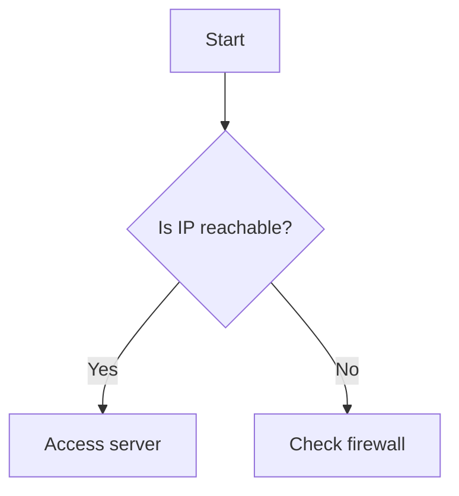

# ✨ Basic Formatting

| Markdown            | Output                      |
|---------------------|-----------------------------|
| `**bold**`          | **bold**                    |
| `*italic*` or `_`   | *italic*                    |
| `**_bold italic_**` | ***bold italic***           |
| `~~strikethrough~~` | ~~strikethrough~~           |
| `` `inline code` `` | `inline code`               |
| `^^highlight^^`     | <mark>highlight</mark>      |
| `==highlight==`     | <mark>highlight</mark> *(same as above)*

# 📋 Headings

```markdown
# Heading 1
## Heading 2
### Heading 3
#### Heading 4
##### Heading 5
###### Heading 6
```

# ✅ Lists

## Unordered:
```markdown
- Item 1
  - Subitem
    - Sub-subitem
* Also works with asterisks
```

## Ordered:
```markdown
1. First
2. Second
   1. Sub-item
```

## Checkboxes:
```markdown
- [ ] Task not done
- [x] Task done
```

# 💬 Blockquotes

```markdown
> This is a quote.
>> Nested quote.
```

# 📦 Code Blocks

## Multiline Code Block:
<pre>
```python
def hello():
    print("Hi")
```
</pre>

## Inline:
`` `print("Hello")` `` → `print("Hello")`

# 🔗 Links & Images

## Link:
```markdown
[OpenAI](https://openai.com)
```

## Image:
```markdown

```
>[!note] you can resize the image using pipe
> ``
# 🔁 Internal Links & Embeds

## Internal link (note):
```markdown
[[Note Name]]
[[Folder/Subnote]]
```

## Embed file/note:
```markdown
![[Note Name]]
![[path/to/image.png]]
```

## Embed specific heading/section:
```markdown
![[Note#Heading]]
![[Note#^blockid]]
```
> [!note]
> Put `!` at beginning only if you want to show the contents there.

## Embed a page from pdf:
```markdown
[[pdf_file#page=4]]
```
# 🎯 Callouts

```markdown
> [!note] This is a note
> You can put **formatted** text inside callouts.

> [!tip] Pro tip
> Use callouts to organize notes better!

> [!warning] Caution!
```

# ➕ Tables

```markdown
| Name    | Age |
|---------|-----|
| Alice   | 25  |
| Bob     | 30  |
```

# ✍️ Footnotes

```markdown
Here's a fact[^1].

[^1]: This is the footnote content.
```

# 🔢 Math (LaTeX)

Inline: ``$E = mc^2$`` →  $E = mc^2$ 

Block:
```markdown
$$
\int_a^b f(x) dx
$$
```

# 🔂 HTML in Markdown

```html
<span style="color: red;">Red text</span>
```

# 🔁 Tags

```markdown
#tagname
#nested/tag
```

# 📌 Comments

```markdown
%% This is a comment %%
```

# 🧱 Frontmatter

```yaml
---
title: My Note
tags: [markdown, obsidian]
created: 2025-05-31
---
```
# Mermaid Diagrams
Input:
```
	```mermaid
	graph TD
	    A[Start] --> B{Is IP reachable?}
	    B -->|Yes| C[Access server]
	    B -->|No| D[Check firewall]
	```
```
Output:

