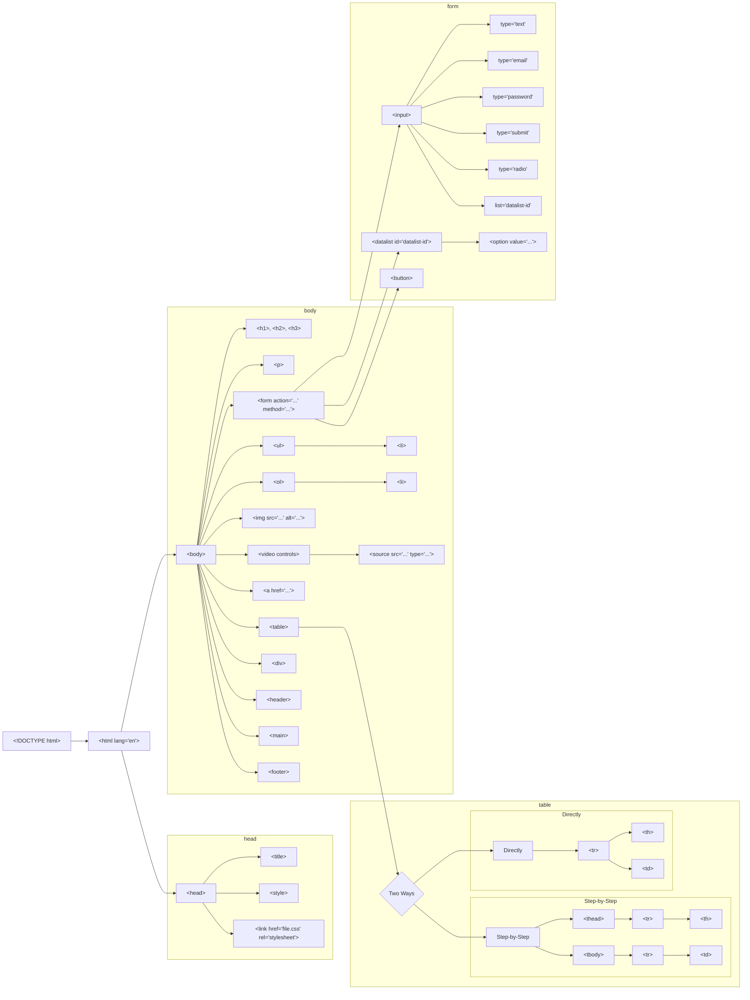

```mermaid
graph LR
    A["&lt;!DOCTYPE html&gt;"] --> B["&lt;html lang='en'&gt;"];
    B --> C["&lt;head&gt;"];
    B --> D["&lt;body&gt;"];

    subgraph head
        C --> C1["&lt;title&gt;"];
        C --> C2["&lt;style&gt;"];
        C --> C3["&lt;link href='file.css' rel='stylesheet'&gt;"];
    end

    subgraph body
        D --> E["&lt;h1&gt;, &lt;h2&gt;, &lt;h3&gt;"];
        D --> F["&lt;p&gt;"];
        D --> G["&lt;ul&gt;"];
        G --> G1["&lt;li&gt;"];
        D --> H["&lt;ol&gt;"];
        H --> H1["&lt;li&gt;"];
        D --> I["&lt;table&gt;"];
        D --> J["&lt;img src='...' alt='...'&gt;"];
        D --> K["&lt;video controls&gt;"];
        K --> K1["&lt;source src='...' type='...'&gt;"];
        D --> L["&lt;a href='...'&gt;"];
        D --> M["&lt;form action='...' method='...'&gt;"];
        D --> N["&lt;div&gt;"];
        D --> O["&lt;header&gt;"];
        D --> P["&lt;main&gt;"];
        D --> Q["&lt;footer&gt;"];
    end

    subgraph table
        direction TB
        I --> I1{"Two Ways"};
        I1 --> I2["Step-by-Step"];
        I1 --> I3["Directly"];
        
        subgraph Step-by-Step
            direction TB
            I2 --> I2A["&lt;thead&gt;"];
            I2A --> I2B["&lt;tr&gt;"];
            I2B --> I2C["&lt;th&gt;"];
            I2 --> I2D["&lt;tbody&gt;"];
            I2D --> I2E["&lt;tr&gt;"];
            I2E --> I2F["&lt;td&gt;"];
        end

        subgraph Directly
            direction TB
            I3 --> I3A["&lt;tr&gt;"];
            I3A --> I3B["&lt;th&gt;"];
            I3A --> I3C["&lt;td&gt;"];
        end
    end

    subgraph form
        M --> M1["&lt;input&gt;"];
        M1 --> M1A["type='text'"];
        M1 --> M1B["type='email'"];
        M1 --> M1C["type='password'"];
        M1 --> M1D["type='submit'"];
        M1 --> M1E["type='radio'"];
        M1 --> M1F["list='datalist-id'"];
        M --> M2["&lt;datalist id='datalist-id'&gt;"];
        M2 --> M2A["&lt;option value='...'&gt;"];
        M --> M3["&lt;button&gt;"];
    end
```    